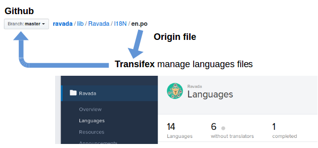

Translations 
============

We use `Transifex <https://www.transifex.com/ravada/ravada/>`__ to
provide a cleaner and easy to use interface for translators.

New entries must be added in the ``en.po`` file.
Because it is the basis of the other language files.

.. Warning:: Please don't add new entries in other .po files directly. Use `Transifex <https://www.transifex.com/ravada/ravada/>`__ instead. If you want to collaborate, create an `Issue <https://github.com/UPC/ravada/issues/new>`_ and give you access as a translator of the language you want.

The language files are stored `here <https://github.com/UPC/ravada/tree/master/lib/Ravada/I18N/>`_ in lib/Ravada/I18N.

Before uploading the changes check if there are repeated msgid.
The ``msguniq`` command should not display any output lines.
::

    $ msguniq --repeated en.po

