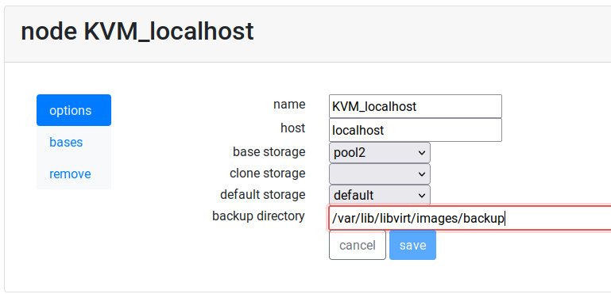

Backup Virtual Machines
=======================

Since release 1.5 it is possible to back up and restore Virtual Machines.
This feature can be used to recover deleted machines, restore contents
after changes and even to migrate machines to another server.

The backup and restore procedures must be used from the command line.

Synopsis
--------

.. prompt:: bash $

  sudo rvd_back --backup machine1
  sudo rvd_back --restore /var/lib/libvirt/images/backup/machine1-2022-04-06.tgz

Backup
------

.. note: To create a Virtual Machine backup the machine must be stopped.

Perform the backup calling the *rvd_back* tool with the names of all
the virtual machines you want to backup.

.. prompt:: bash $

  sudo rvd_back --backup machine1 machine2 ... machineN

Clones and bases
~~~~~~~~~~~~~~~~

Only the files and definitions are stored in the backup file. If you
want to backup a clone and you want to make sure you can restore it
correctly, do a backup of the parent base too.

.. prompt:: bash $

  sudo rvd_back --backup base clone1 clone2 ...

Owner
~~~~~

Information and metadata of the virtual machine is backed up too.
If you ever removed the owner but you restore the virtual machine
later, the user information such as name and password will be
restored too.

Restore
-------

To restore a Virtual Machine you must pass the path of the filename where
the compressed backup has been stored.

.. prompt:: bash $

  sudo rvd_back --restore /var/lib/libvirt/images/backup/machine1-2022-04-06.tgz

If Ravada detects this virtual machine is already there it will ask
for confirmation. Metadata and user information will be restored
along with filesystem contents.

Migration to another server
---------------------------

The backup file can be used to migrate the virtual machine
to another Ravada server. Just copy the file and call *rvd_back --restore*.
Be careful: if you want to migrate a clone, the base must be migrated
first.

Owner users will be creted in the new virtual machine if they don't
exist. The users will be assigned regular user permissions. Specially
granted privileges or administration roles must be set
up manually after restoring.

.. prompt:: bash $

  sudo rvd_back --restore /home/machine1-2022-04-06.tgz

Backup directory
----------------

The default backup directory will be the folder *backup* inside the
default storage pool. In most systems that will be located at:
*/var/lib/libvirt/images/backup*. You can set another directory
from the *Node Management* menu in the frontend: go to *Admin Tools*
and select *Nodes*, then in *KVM_localhost* change the backup
directory and save it.

