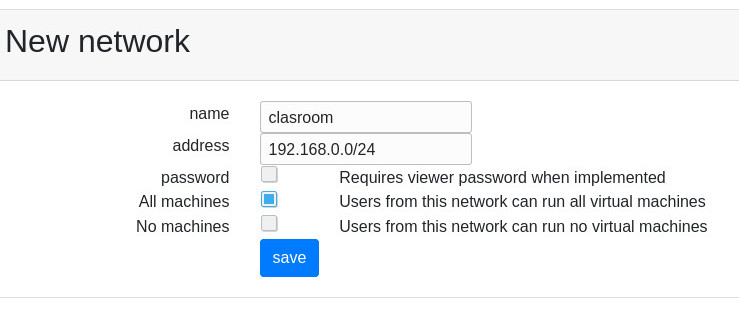

Disable Spice Password
======================

When the users start a virtual machine, a password is defined for the spice connection.
This can be disabled for a given network or in the main settings.

If you want to disable Spice passwords for all the virtual machines in all the networks,
disable it in *Admin Tools* , then *Settings*. The option is *Display Password*.

Follow the next guide if you want to disable the display password only for clients
that access from some networks.

Define the network
------------------

Choose the *Admin Tools* option *Networks*. Create a new network and enable the settings
that suit you best.

    New network form

    Set a name for this network definition, you may want to allow access without
    client password. Enable *all machines* so users from this network can access the
    virtual machines.

Applying settings
-----------------

This settings applies on starting a new virtual machine. So running virtual machines
will keep the former settings. Shutting them down and up will trigger the new
configuration.

Default setting
---------------

Any other network requires password as defined by the '0.0.0.0/0' network setting.

Why is that ?
-------------

Ravada opens SPICE connections and manages iptables to make sure no one can
connect to another user's virtual machine. This is also enforced through the
password setting. Please consider disabling it only in controlled, seat-unique ip
environments. Configuring SPICE-TLS is recommended.
