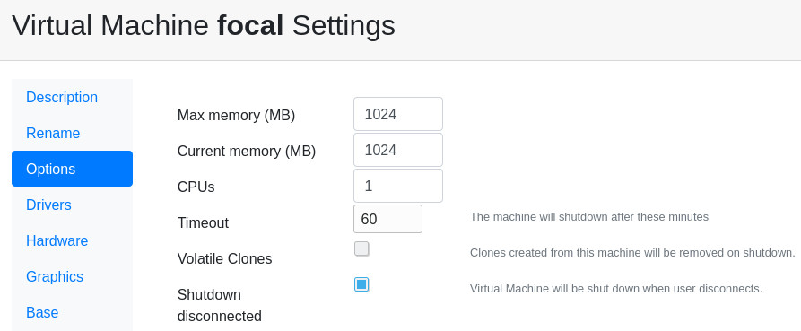

Kiosk Mode
==========

Kiosk ( or anonymous ) allows any user, not logged in, to create a volatile
virtual machine. Once this machine is shut down, it is destroyed automatically.

Setting
-------

This *kiosk* mode must be defined for some bases in some networks.

Define a Network
----------------

You can allow kiosk mode from any network, but you can define a new network where
this mode is allowed.

Go to Admin Tools, Networks and click *New Network*.

.. image:: images/new_network.jpg

Allow anonymous mode
--------------------

You can allow anonymous access to some bases from the networks management form.

Go to Admin Tools, Networks and click in the name of the network. If you want to
grant anonymous users to everyone use the *default* network. This is not a good
practice unless the server is behind a firewall. Otherwise create a new network
and grant anonymous access only to the users that come from there.

Click on the button *Machines*. A list of all the bases will be shown. For a base
to be used anonymously it must be defined as public and the *anonymous* option must
be selected.

In this example we configure anonymous access to the base called *focal*.

.. image:: images/new_network.jpg

Setting a base as *public* allows any known user with access to run it. Anonymous gives
access to everyone in your network without an username.

Auto remove anonymous machines
------------------------------

Virtual machines created for anonymous users can be easily and automatically removed.
Go to Admin Tools, Machines, and click in the name of the base. In the *Options* tab
enter a *timeout* and optionally *shutdown disconnected*.

In this example the virtual machine will be destroyed when the user closes the viewer
or after running for 60 minutes.

Access
------

Access now to the anonymous section in your ravada web server. http://your.server.com/anonymous

You should see there the base of the virtual machine you allowed before.

