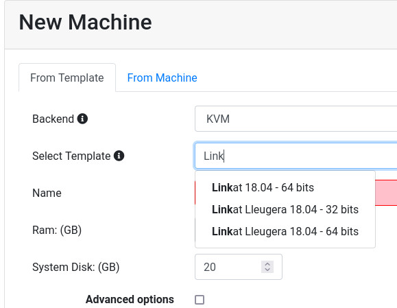

Localized ISO downloads
=======================

It is possible to add localized Linux installation images
to create virtual machines.

In this image we see the user can download the *Linkat* Linux Distribution
in Catalan which normally is not available.

Enabling localized distributions
--------------------------------

There are two ways these special localized Linux Distributions are
enabled: when an user logs in using this language or from the CLI.

Enabling localized distrubionts logging in
~~~~~~~~~~~~~~~~~~~~~~~~~~~~~~~~~~~~~~~~~~

As soon as an user logs in and has the web browser configured with
one of the avaialable localized ISO this is added to the list.
When the user creates a new virtual machine the new template is
automatically available.

Enabling localized distrubionts from CLI
~~~~~~~~~~~~~~~~~~~~~~~~~~~~~~~~~~~~~~~~

There is an easy way to enable the localized Linux Distribution
from the command line. Just call the *rvd_back* application with
the *--add-local-repository* parameter.

In this example we enable the Russian repository so now *Astra Linux*
is available to download.

.. prompt:: bash

  sudo rvd_back --add-locale-repository ru

Adding more localized distributions
-----------------------------------

Let us know if you want to have your distributions listed.
The best way is to contribute to our project with a new config file.

You can see a real world example for the Russian repository.
It must be created inside the directory *etc/repository/iso*
with the name of the locale.

Then there must be at least one *YML* file with the description
of the ISO image to download.

`Russian Astra Linux example <https://github.com/UPC/ravada/blob/main/etc/repository/iso/ru/astra_orel_2.yml>`_.

In this example we give the name and description of the Linux Distribution.
We base the virtual machine in Bionic Ubuntu Linux 64 bits. It does not
matter if the new distribution does not come from Ubuntu. It just uses
it for creating the CPU, Memory and common virtual hardware.
Also it is required to give the minimal disk space required for installing
this Linux distro.

::

  name: Astra Linux
  description: Astra Linux Orel 2.12.13 64 bits
  url: https://mirrors.edge.kernel.org/astra/current/orel/iso/
  file_re: orel-2..*.iso
  md5_url: $url/orel-2.*md5
  arch: amd64
  xml: bionic-amd64.xml
  xml_volume: bionic64-volume.xml
  min_disk_size: 5
  min_ram: 2

If you have problems contributing to our code you can ask for assistance
or you may send us the *yml* file yourself.
