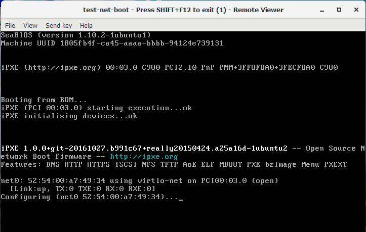
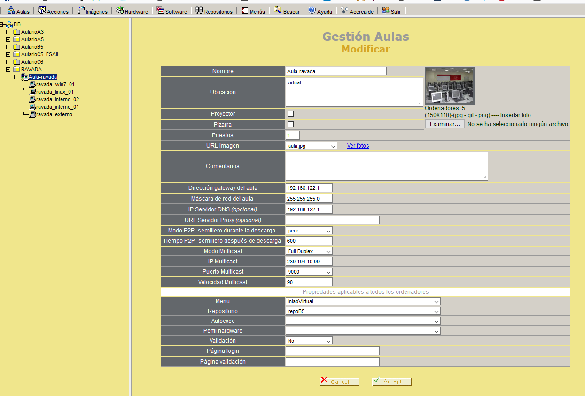
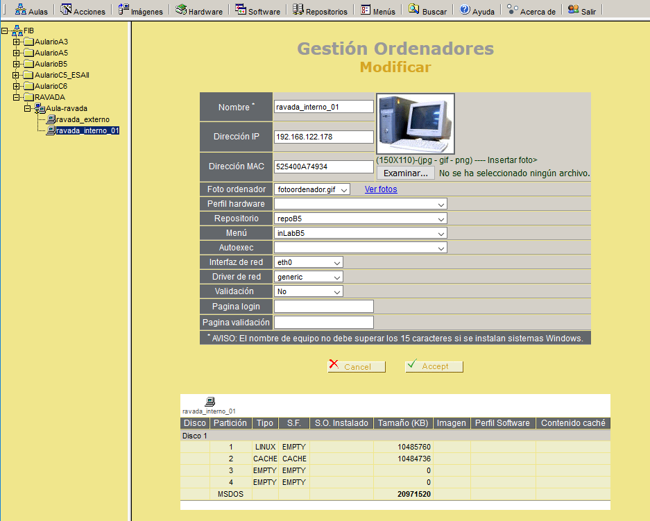
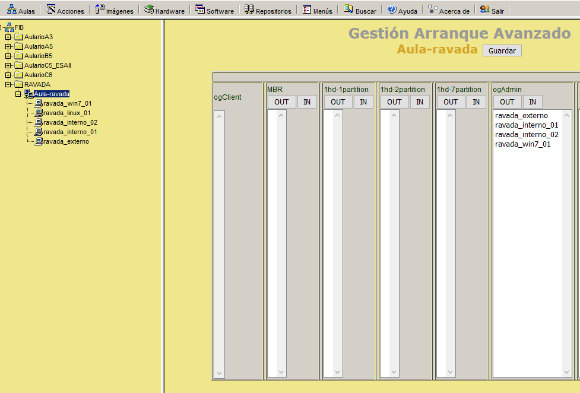
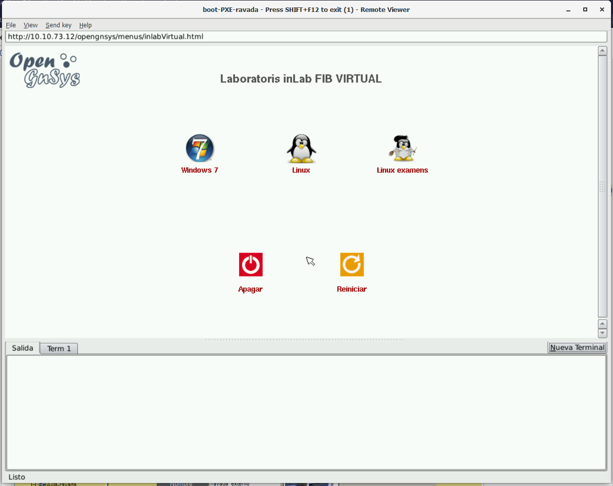

.. Ravada VDI documentation 
   Integrating Ravada and OpenGnsys 
   Dani Sanchez - 28/Nov/2018

Integrating Ravada and OpenGnsys 
================================

Opengnsys is a open source project for remote deployment. This is a project developed for many Spanish universities to provide a full tool to deploy, manage, clone and manage remote computers. Opengnsys allow distribute and install many different operating systems. 

Opengnsys is based in a PXE boot and a Linux graphical agent that allows manage remotely the computer from a centralized console. Here, we will explain how adapt our RAVA system to support boot from Opengnsys. The final objective is automate the creation a virtual machine with the same image that we have created for our classrooms.

DHCP boot options
~~~~~~~~~~~~~~~~~

First of all, we have to provide the dhcp options ``next-server`` and ``filename``. to our dhcp server. Ravada is a KVM-based solutions, so, the dhcp server is the standard integrated in KVM. The DHCP-KVM server allows some configurations. Edit the KVM network configuration and add these options to the dhcp section:
       
.. prompt:: bash $

   virsh#virsh net-edit default 
   <network>
   <name>default</name>
   <uuid>85909d3b-f219-4055-92a3-d36c0c57810c</uuid>
      <forward mode='nat'/>
      <bridge name='virbr0' stp='on' delay='0'/>
      <mac address='52:54:00:1a:06:50'/> 
      <ip address='192.168.122.1' netmask='255.255.255.0'>
      <tftp root='/'/>
      <dhcp>
         <range start='192.168.122.30' end='192.168.122.254'/>
         <bootp file='grldr' server='<opengnsys-server-ip'/>
      </dhcp>
      </ip>
   </network>
                                              
``grldr`` is the standard boot loader for Opengnsys.

Create and empty virtual machine
~~~~~~~~~~~~~~~~~~~~~~~~~~~~~~~~

Now, you have to create and empty virtual machine. And empty machine boots from the iPXE network boot firmware client integrated in KVM. This is a snapshot of a vm booting process:

NAT adaptation 
~~~~~~~~~~~~~~

Now, we have detected that TFTP doesn't work with the default KVM NAT configuration. You have to add support for it. 
This document explain it: https://beaveryoga.wordpress.com/2016/12/10/iptables-and-tftp-howto/

Create the virtual machine in the Opengnsys console
~~~~~~~~~~~~~~~~~~~~~~~~~~~~~~~~~~~~~~~~~~~~~~~~~~~
We have to create the support configuration to this virtual PC in the Opengnsys console. 

The virtual machine runs inside a NATed network, usually with a 192.168.122.0/24 IP address. Then, these vms uses the Ravada server as gateway. We have to create an new classroom with the NAT configuration to allow opengnsys to assign correctly the network mask and the gateway. This is the ravada-classroom configuration:

* gateway: 192.168.122.1 (KVM NAT default gateway)
* netmask: 255.255.255.0 (KVM NAT default netmask)
* IP multicast: your multicast group 
* Menu: your page menu
* Repository: your image repository

Now, we have to create a computer inside your ravada classroom that is your virtual machine. Copy the MAC address of your empty machine:

.. prompt:: bash $
 virsh net-dhcp-leases default 
 Expiry Time          MAC address        Protocol  IP address                Hostname        Client ID or DUID
 -------------------------------------------------------------------------------------------------------------------
  2018-11-27 09:11:39  52:54:00:a7:49:34  ipv4      192.168.122.178/24        -               01:52:54:00:a7:49:34

And now, re-generate the TFTPBOOT files:

In this example, we have assigned the new PC to the ``ogAdmin`` group.

Now, you can boot the empty machine: 

We have detected that the new machine boots, but it hangs just when the menu had to appear. After debugging, we have detected that the virtual machine don't have access to the http server with the menus. This a problem with routing. We have resolved creating a fake computer with the IP and MAC address of the KVM external NAT:

.. prompt:: bash $
 ifconfig 
  br0: flags=4163<UP,BROADCAST,RUNNING,MULTICAST>  mtu 1500
  inet 10.10.73.24  netmask 255.255.255.0  broadcast 10.10.73.255
  inet6 fe80::20a:f7ff:feba:c980  prefixlen 64  scopeid 0x20<link>
  ether 00:0a:f7:ba:c9:80  txqueuelen 1000  (Ethernet)
  RX packets 11251336  bytes 196755808380 (196.7 GB)
  RX errors 0  dropped 0  overruns 0  frame 0
  TX packets 11875794  bytes 4220061188 (4.2 GB)
  TX errors 0  dropped 0 overruns 0  carrier 0  collisions 0

.. image:: images/opengnsys_fake_computer.png

Parameters:
* IP: external NAT address of your RAVADA system
* MAC: external MAC address of your RAVADA system

This is our standard menu:

Now, you can boot your standard images in a virtual environment of Ravada. You have to be sure that your images have support to run in a virtualized system. In Linux images, the kernel have support ``/dev/vda`` devices. In Windows systems, you have to add the virtio drivers. 

Special script adaptation
~~~~~~~~~~~~~~~~~~~~~~~~~

Our images boots ok, but our opengnsys instance doesn't detect the virtual disk. The problem was in our system, wich is very old (v1.0.5). To add support to detect `/dev/vda devices`, we have patched the ``/opt/opengnsys/client/lib/engine/bin/Disk.lib`` library:

.. prompt:: bash $

# Listar dispositivo para los discos duros (tipos: 3=hd, 8=sd 253=vda). inLab 2018
ALLDISKS=$(awk '($1==3 || $1==8 || $1==253) && $4!~/[0-9]/ {printf "/dev/%s ",$4}' /proc/partitions)
VOLGROUPS=$(vgs -a --noheadings 2>/dev/null | awk '{printf "/dev/%s ",$1}')
ALLDISKS="$ALLDISKS $VOLGROUPS"

This patch adds vda disk detection to the ``ogDiskToDev`` function. (minor 253 -> vda devices). This problem was fixed in later versions.
