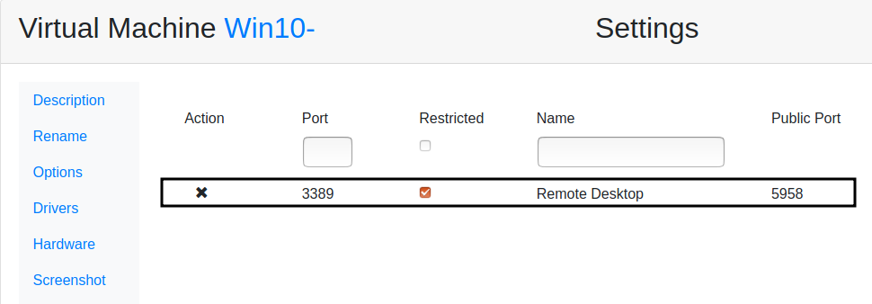
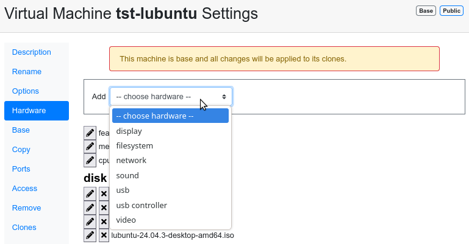

How to allow RDP connections
============================

If someone have performance problems opening a Windows Virtual Machine using Spice, one possible solution is to use a RDP connection instead of Spice.

Steps to open RDP
-----------------

   1. Open the clon or the machine before convert it in a base.

   2. Allow RDP connections: `remote desktop allow access <https://docs.microsoft.com/en-us/windows-server/remote/remote-desktop-services/clients/remote-desktop-allow-access>`__.

Configure exposed port
----------------------

Once the port is opened it's time to configure the exposed port from the Virtual Machine, to do this follow the steps in 
`configure-expose <https://ravada.readthedocs.io/en/latest/docs/expose_ports.html?highlight=ports#configure-expose>`__.

In this case, the Port field must be set with the RDP number:

- *Port*: 3389

Open the Virtual Machine with a RDP client
------------------------------------------

Open your remote desktop client and configure the new connection. Pay attention to the port number, it is redirected to another port number. You can see the open ports when start the Virtual Machine in Open ports section:

In the next list you have the recommended software to do a RDP connection with 3 Operating Systems:

- *Linux*: `Remmina <https://remmina.org/>`__.

- *Windows*: Included in the System as Remote Desktop, `more information <https://docs.microsoft.com/en-us/windows-server/remote/remote-desktop-services/clients/windowsdesktop#install-the-client>`__.

- *MacOSX*: `Microsoft Remote Desktop <https://apps.apple.com/es/app/microsoft-remote-desktop-10/id1295203466?mt=12>`__.

In this `link <https://docs.microsoft.com/en-us/windows-server/remote/remote-desktop-services/clients/remote-desktop-clients>`__ are other RDP clients, depending on differents Operating Systems.

