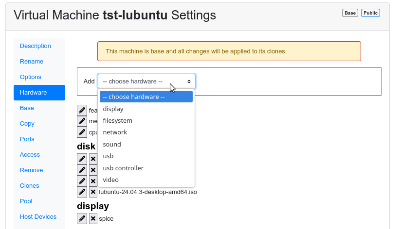
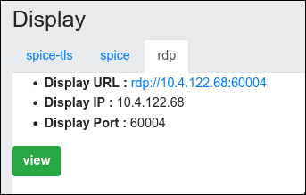

How to allow RDP connections
============================

If someone have performance problems opening a Windows Virtual Machine using Spice, one possible solution is to use a RDP connection instead of Spice.

Steps to open RDP
-----------------

   1. Configure RDP Display

   2. Allow RDP connections

Step 1: Configure RDP Display
-----------------------------

Edit the virtual machine settings clicking in the name in the admin machines page.
Go to the Hardware tab and add a new display for 'Windows RDP'

Yo do not need to add the display in each Virtual Machine clone. Setting the
RDP in the base replicates this configuration to all the clones. This works
even after the clones have been created.

Now you should have two ways to access the virtual machine display: SPICE and RDP.
SPICE will always
work because it is a virtual hardware available on startup. RDP requires the virtual
machine to properly launch and start the RDP service. Once you are sure RDP works, you
may want to remove the SPICE display to make it easier for your users.

Step 2: Allow RDP connections
-----------------------------

Once the display is configured, you need to enable RDP connections to the virtual machine.
This may require install or enable RDP service.

RDP for Windows
~~~~~~~~~~~~~~~

In the virtual machine, enable Windows RDP protocol.

You may want to open the windows menu and search for the "Remote Desktop Configuration".
Enable the RDP access there.

Follow this official Microsoft guide:
`Windows remote desktop <https://docs.microsoft.com/en-us/windows-server/remote/remote-desktop-services/clients/remote-desktop-allow-access>`__.

Sometimes RDP will not work or requires extra settings in the virtual machine.

* Allow remote assistance
* Allow remote connections
* Disable Allow only connections from computers that execute remote desktop with network level authentication

If it still is not working, check in "Local Services" and make sure those are enabled:

* Remote Desktop Configuration
* Remote Desktop Services

RDP for Linux
~~~~~~~~~~~~~

RDP for Linux requires the installation of xrdp package.

.. prompt:: bash $

   sudo apt install xrdp

For optimal performance to remote locations it is advisable to tune down security and
graphics. Edit the file /etc/xrdp/xrdp.ini

::

    crypt_level=low
    max_bpp=16

Open the Virtual Machine with a RDP client
------------------------------------------

Clicking the *View* button should launch the remote desktop client with the proper
connections settings.

If you open your RDP client manually, pay attention to the port number.

In the next list you have the recommended software to do a RDP connection with 3 Operating Systems:

- *Linux*: `Remmina <https://remmina.org/>`__.

- *Windows*: Included in the System as Remote Desktop, `more information <https://docs.microsoft.com/en-us/windows-server/remote/remote-desktop-services/clients/windowsdesktop#install-the-client>`__.

- *MacOSX*: `Microsoft Remote Desktop <https://apps.apple.com/es/app/microsoft-remote-desktop-10/id1295203466?mt=12>`__.

In this `link <https://docs.microsoft.com/en-us/windows-server/remote/remote-desktop-services/clients/remote-desktop-clients>`__ are other RDP clients, depending on differents Operating Systems.

Troubleshooting
===============

RDP port appears down
---------------------

- Make sure the service is running in the virtual machine
- Check there is not a firewall in the virtual machine that blocks RDP
- Review the previous steps and make sure everything is installed and running

If you check the service is running but the port keeps showing as *down* when
starting the machine, check the host iptables.

::

    -A INPUT -s 192.168.122.0/24 -i virbr0 -j ACCEPT
    -A OUTPUT -s 192.168.122.0/24 -o virbr0 -j ACCEPT

Linux: Authentication Required to Create Managed Color Device
-------------------------------------------------------------

When the user logs in with RDP in a Linux Machine it gets a warning and requires
authentication for the *Managed Color Device*.

To disable this message create the file /etc/polkit-1/localauthority.conf.d/02-allow-colord.conf

::

 polkit.addRule(function(action, subject) {
 if ((action.id == "org.freedesktop.color-manager.create-device" ||
 action.id == "org.freedesktop.color-manager.create-profile" ||
 action.id == "org.freedesktop.color-manager.delete-device" ||
 action.id == "org.freedesktop.color-manager.delete-profile" ||
 action.id == "org.freedesktop.color-manager.modify-device" ||
 action.id == "org.freedesktop.color-manager.modify-profile") &&
 subject.isInGroup("{users}")) {
 return polkit.Result.YES;
 }
 });

And reboot.

`More information about polkit and xRDP <https://c-nergy.be/blog/?p=12073>`__
