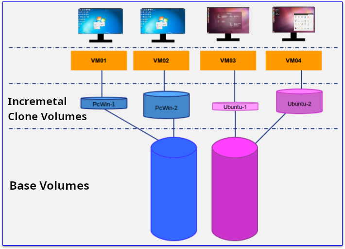
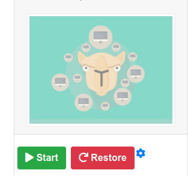
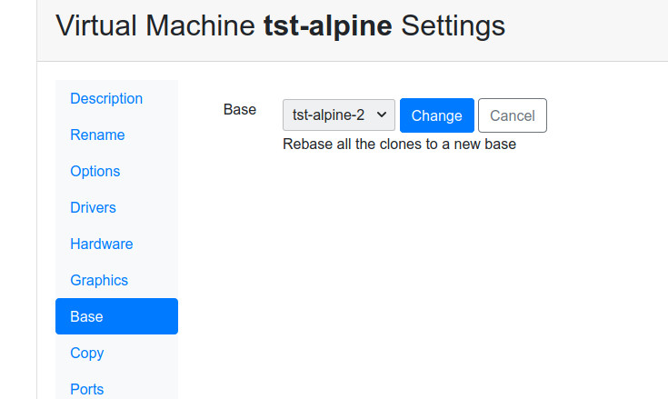

Keeping the Base updated
========================

Base volumes
------------

Once a base is prepared and clones are made the base becomes *read only*.
This is required because the clones disk volumes depend of the data stored
in the bases. So it is not possible to change the base because the clones
storage would become corrupted.

Rebasing
--------

There is a way to keep the base updated for all the clones. This require
you create a new base from the old one and make all the clones depend from
the new one. This is called *rebase* and requires careful preparation in advance.

Virtual Machine Volumes
-----------------------

Restoring clones
~~~~~~~~~~~~~~~~

Before showing the virtual machine volumes, we must explain the restore procedure.

When an user requests a *restore* of a clone. This virtual machine system
information get removed. When it starts again the original content created
in the base will show up.

This is different than removing the Virtual Machine. If it is removed all
the content and the Virtual Machine itself will be deleted. So just restored
machines still are shown in the lists.

Volume Types
~~~~~~~~~~~~

There are thre kinds of disk volumes that can be assigned to the Virtual Machines:

- System: This is the normal storage. Removed on restore.
- Temporary:  Content will be cleaned on restore and shutdown
- Data: Content will be kept on restore

So you should use temporary volumes for *swap* , *pagefile* or other temporary files.
Use data volumes to store users files and other information that doesn't depend
of the operative system.

When you *rebase* a virtual machine, system volumes will be replaced and
*data volumes will be kept untouched*.

Rebase requirements
-------------------

When you rebase, the new base virtual machine must have the same storage outline
as the old base. A good practice is to clone the old base, do some changes and
make it the new base.

After the rebase procedure is completed, the operative system will be replaced,
the temporary files would be restored to their initial state and the data volumes
will be exactly like they were before rebasing.

Run rebase on the virtual machine options at the base screen. You can rebase only
one clone or request all the clones to be updated. This will take a few minutes.
It depends of the size of the virtual machine volumes.

