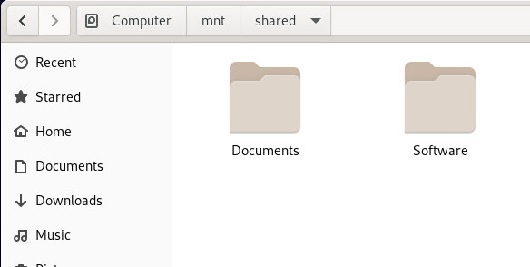
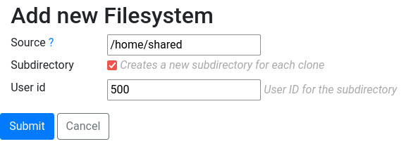

VirtioFS
========

Virtiofs is a shared file system that lets virtual machines access a directory tree on the host. It is available since Ravada v1.6.

Usage Examples
--------------

Shared Space
~~~~~~~~~~~~

Directories and files can be shared from the host to the virtual
machines. All kinds of files and data can be stored for read and
write access. Read-only mode can be optionally enforced at mount time.

Private Space
~~~~~~~~~~~~~

It can be configured a private space for each virtual machine.
Unprivileged users will only be able to write and read their own files.
It can be granted special access to all the data if it is required.
A case usage could be to store students assignments and the teacher
is granted access to all the files.

Requirements
-------------

VirtioFS works only with libvirt 6.2. It is installed in these Linux
Distributions:

* Ubuntu 22.04
* Debian 11
* Alpine 3.16

( TODO : Please contribute if you are aware of more , thank you ! )

Virtual Machine Configuration
-----------------------------

In the hardware section of the virtual machine, add a new *filesystem* item.
You have to pass the full path you want to share with the virtual machine.

.. figure:: images/new_virtiofs.jpg
    :class: with-border

Linux
-----

Using virtiofs from Linux virtual machines is pretty straightforward
and the drivers come already with any latest kernel.

Mount in the Virtual Machine
~~~~~~~~~~~~~~~~~~~~~~~~~~~~

To mount the partition add a line in the fstab with the source name
and the directory you want to mount it. In this example we mount
the directory exported from */home/shared*, that will be called
*home_shared*. It will be mounted in the path */mnt/shared* inside
the virtual machine.

.. code::

  home_shared /mnt/shared virtiofs rw,relatime 0 0

Create the mount path */mnt/shared* and type `mount -a` to try it.

Mount read-only
~~~~~~~~~~~~~~~

In the first example we accessed the directory with read and write options.
If you want to access it read only, mount it this way:

.. code::

  home_software /mnt/software virtiofs ro,relatime 0 0

Mount in Windows
----------------

`See this manual to use VirtioFS from Windows <https://virtio-fs.gitlab.io/howto-windows.html>`_.

Changing the owner of the directory
-----------------------------------

In the previous section we created a directory for all the virtual
machines to see. It is usually ok if you just want to share files
read only or that only root can write to. It is possible to allow
the user of the desktop to write in this shared location right away.

Set the user id
~~~~~~~~~~~~~~~

Setting the user id is very important because the user will not
be able to write unless it is carefully chosen. To do so start
the virtual machine and check what is the user id for the user.
It is usually created at installation time. If you are not sure
what is the name of the user, just boot the base, enter the desktop
and that command.

.. prompt:: bash user@virtual-machine:~$

   id `whoami`

The very first numerical value returned is the one you must configure for
the shared filesystem.

The owner of the shared filesystem must be set first in the host. Access
the server where all the virtual machines are stored and change the owner
with the *uid* you just found out in the previous step.

.. prompt:: bash frankie@host:~$

   sudo chown 1000 /home/shared

Mount Subdirectory in the base
~~~~~~~~~~~~~~~~~~~~~~~~~~~~~~

First you have to create the mount point in the virtual machine.
The owner of that subdirectory must be the user that runs the desktop.

.. prompt:: bash root@virtual-machine:~#

   mkdir /mnt/shared
   chown 1000 /mnt/shared

Then add it to the *fstab* file so it gets mounted on boot unless you
already did in the previous step.

.. code::

    home_shared /mnt/shared virtiofs rw,relatime 0 0

Reboot and check it is mounted when booting:

.. prompt:: bash

    df | grep shared

You must see something like this, with the name of the partition first,
and the mount point.

.. propmt:: code

    home_shared /mnt/shared virtiofs rw,relatime 0 0

Check the user is able to write there:

.. prompt:: bash user@virtual-machine:~$

   touch /mnt/shared/test
   rm /mnt/shared/test

Subdirectory Mode
-----------------

The basic usage is having a directory that all the clones can see.
It is possible to have each cloned virtual machine to have its own
private space.

This works creating a subdirectory for each clone when it is created.

Create Subdirectory filesystem
~~~~~~~~~~~~~~~~~~~~~~~~~~~~~~

Create a base and add a shared partition, but this time
select the checkbox for *Subdirectory*. Also set the user id that
will be the owner of the files.

See the previous step to find out what user id you must define here:
*"Changing the owner of the directory"*

Set the owner
~~~~~~~~~~~~~

Make sure the user is set as the owner of the directory mountpoint,

Prepare the Base
~~~~~~~~~~~~~~~~

Once the filesystem is setup and you have checked it boots okay and
the user can write there, prepare the base either clicking the checkbox
in admin machines or in the virtual machine setup.

How the clones see it
~~~~~~~~~~~~~~~~~~~~~

When the user boots the clone, all that is shown is a directory mounted
at /mnt/shared with the contents this user writes.

How is it stored in the server
~~~~~~~~~~~~~~~~~~~~~~~~~~~~~~

If you inspect the contents of the server partition after some clones
have used this, you will see something like this:

.. code::

   # ls /home/share
    drwxr-xr-x 2    1000 root 4096 june  14 11:04 tstbull-username1
    drwxr-xr-x 2    1000 root 4096 june  14 11:04 tstbull-username2

Further inspections of the content of the subdirectory tstbull-username1
will provide the files the the user has created from the virtual machine.

Read More
---------

`More information about VirtioFS <https://virtio-fs.gitlab.io/>`_.
