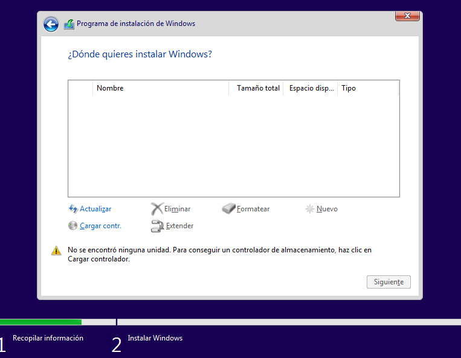

~~~~~~~~~~~~

The installer may not see the virtual machine disk drive.
Choosing "Load Drivers" in this screen and select

Click on "Examine", you should see two CD units. The drivers are
in the second one called something like "virtio-win".
Choose *amd64* and then select the operative system you are installing.

For *Windows 11* it should the driver as
*Red Hat VirtIO SCSI controller (E:\amd64\w11\viostor.inf)*

 Click on *Next* to continue installing Windows.
