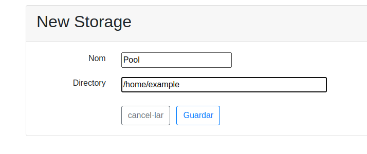

Add KVM storage pool
====================

If you run out of disk space you may add a new disk. 

.. note :: 
    KVM mush then be informed about this new space available by creating a new storage pool.

Add the drive to the system
---------------------------

After booting with the new drive, check dmesg to find out the name of
the new disk. It will probably be called /dev/sdSOMETHING.

Double check this is actually the new disk, if not you may erase all the
contents of the system. Type *df* to see the old disk partitions.

Create a new partition with *fdisk*. It should show it as empty. Add
only one primary partition for all the free space.

Replace *sdX* by the real name of the new device:

.. prompt:: bash $

    sudo fdisk /dev/sdX

Format it with large files tunning:

.. prompt:: bash $

    sudo mkfs.ext4 -m 0.001 -T largefile /dev/sdX1

Mount the new partition
-----------------------

First find out the UUID.
Copy the UUID value, use it for the next step.

.. prompt:: bash $

    blkid | grep sdX1

Add this new partition to the filesystem table:

.. prompt:: bash $

    sudo mkdir /var/lib/libvirt/images.2
    sudo vim /etc/fstab

::

    UUID=e5ff57d7-cde6-4117-ac5d-1b14ac5b218f  /var/lib/libvirt/images.2 ext4  auto    0   3

It will mount it next time you boot, but it can be used without
rebooting issuing:

.. prompt:: bash $

    sudo mount -a

Add the drive to the Virtual Manager
------------------------------------

You must access the link of your own server. Then access Administration Tools>Storage and select New Storage; 
Select the name and directory and confirm the changes

And that's it, now Ravada will use the pool that has more empty space
the next time it needs to create a volume. If you want to fine tune
what storage pool is used by default follow the
`advanced settings documentation <advanced_settings.html>`__ .
