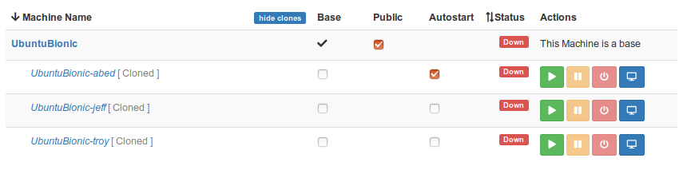
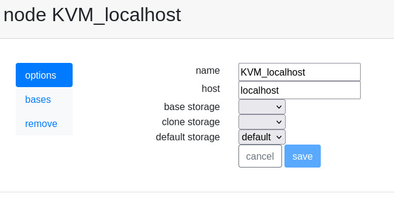

Ravada advanced settings
========================

Display IP
-----------

On a server with many IP address, the configuration file allows the
administrator define which one is used for the display. Change the
field *display_ip* in the Virtual Managers (VMs) table. Set there
the public address of the server.

.. Tip:: With recent releases of ravada this shouldn't be necessary. Ravada uses the routing table from the server and sets the display IP from there.

If you want to force the display IP do it this way:

For Ravada 0.9 and older set it at /etc/ravada.conf:

::

    display_ip: public.display.ip

Since Ravada 0.10 you have to change it in the database:

.. prompt:: bash $,(env)...$ auto

    mysql -u rvd_user -p ravada
    mysql> select id,name,display_ip from vms;
    +----+---------------+-----------------+
    | id | name          | display_ip      |
    +----+---------------+-----------------+
    |  1 | KVM_localhost |                 |
    |  2 | barrufet      |                 |
    +----+---------------+-----------------+
    mysql> UPDATE vms set display_ip='1.1.1.44' where id=1;
    mysql> UPDATE vms set display_ip='1.1.1.55' where id=2;

NAT
---

The Ravada server can be behind a NAT environment. So the public address
the client gets may not be the one configured in the Ravada server interface.
You need to tell Ravada this IP. Then it will be shown to the end users for
their client connection.

Example:

::

      _______
  ___|_RVD   |_______________ NAT ________________ client
     | Server|10.0.0.44             2.2.2.55
     |_______|

By default, the IP that is shown to the users will be 10.0.0.44 , but it is not
accessible from outside.

For Ravada 0.9 and older set it at /etc/ravada.conf:

::

    nat_ip: the.external.ip.address

Since Ravada 0.10 you have to change it in the database:

You must configure the NAT IP in the Virtual Managers (VMs) table.

.. prompt:: bash $,(env)...$ auto

    mysql -u rvd_user -p ravada
    mysql> select id,name,nat_ip from vms;
    +----+---------------+-----------------+
    | id | name          | nat_ip          |
    +----+---------------+-----------------+
    |  1 | KVM_localhost |                 |
    +----+---------------+-----------------+
    mysql> UPDATE vms set display_ip='2.2.2.55' where id=1;

If you have more nodes, each one probably will have its own public NAT IP. Set each
one of them in the same way you set for the main node or Virtual Manager.

Auto Start
----------

Virtual machines can be configured to start automatically when the physical host boots.

You can enable the auto start column at the frontend configuration file at
/etc/rvd_front.conf .
Reboot the frontend with systemctl restart rvd_front to display the changes.

::

    /etc/rvd_front.conf

    {
        admin => {
            autostart => 1
        }
    };

Choosing Storage Pool
---------------------

Default Storage Pool
~~~~~~~~~~~~~~~~~~~~

When creating virtual machines, Ravada chooses the storage pool with more free space
available. If you want to force another, change the settings updating in the *Nodes setting*
form in the frontend.

From *Admin Tools*, select *Nodes*. You will likely have only one : *KVM_localhost*.

It may take a while to refresh this setting. Restart rvd_back running *systemctl restart rvd_back* if you want it applied right away.

Specific Storage Pools
~~~~~~~~~~~~~~~~~~~~~~

Specific storages for bases and clones can be defined. This way you can
use small and fast disk drives for bases and big but slower disks for clones.

.. Warning:: If you set base and clone storages here, the default storage setting is ignored.

Add and define the storage pools as described in the
`add kvm storage pool <add_kvm_storage_pool.html>`__ manual. Then change the
values in the node options screen.

.. Warning:: These changes will apply to new virtual machines. Old virtual machines
    have already the disk volumes defined and can't be easily changed.

Chek free memory ( from v0.3 )
------------------------------

Before start the domain, free memory of the Virtual Manager can be checked.
This feature is only available in the development release.

First check the id field of the Virtual Manager in the table *vms*, then
set the minimun of free available memory. In this example we require a
minimun of 2 GB free:

.. prompt:: bash $,(env)...$ auto

    mysql -u rvd_user -p ravada
    mysql> select * from vms;
    mysql> update vms set min_free_memory=2000000 where id=*id*;
