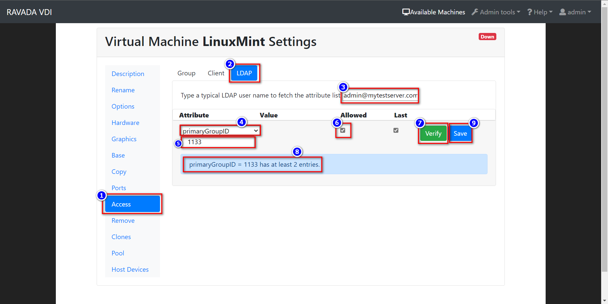
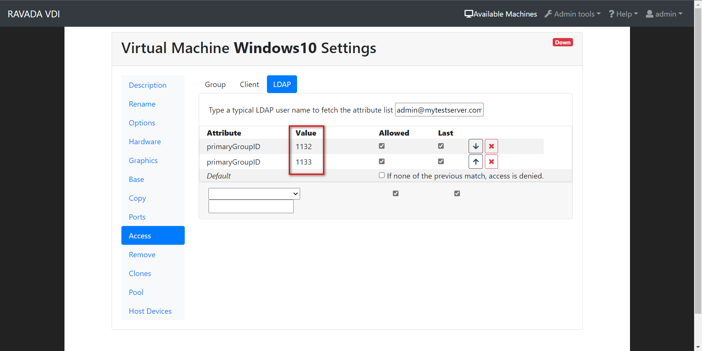
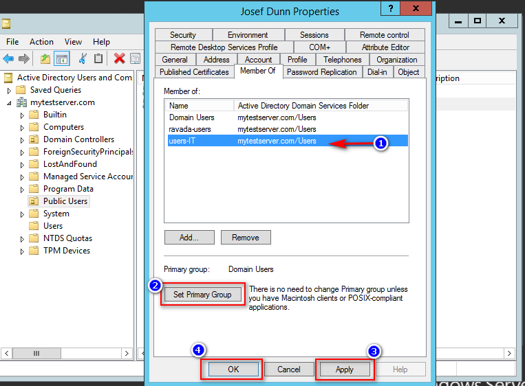

Authentication with Active Directory
====================================

Active Directory authentication can be configured using
special LDAP attributes.

Configure Ravada
----------------

Add this entries to the file /etc/ravada.conf.

::

    ldap:
        server: ad.server.ip
        port: 636
        base: cn=Users,DC=directory,DC=domain,DC=tld
        field: sAMAccountName
        admin_user:
          dn: cn=LDAP Query User,cn=Users,DC=directory,DC=domain,DC=tld
          password: xxxx

After changing the config file, restart the front service and try to login. `sudo systemctl restart rvd_front`.

Alternative login field
~~~~~~~~~~~~~~~~~~~~~~~

A typical user has both *full name* and *logon* fields. For example:

* Full Name ( sAMAccountName ) : Jhonny Xin
* Logon ( userPrincipalName ) : joxin@mytestserver.com

The basic configuration will allow the users login with their full name.
You may prefer to user the logon field: *userPrincipalName*

::

    ldap:
        server: ad.server.ip
        port: 636
        base: cn=Users,DC=directory,DC=domain,DC=tld
        field: userPrincipalName
        admin_user:
          dn: cn=LDAP Query User,cn=Users,DC=directory,DC=domain,DC=tld
          password: xxxx

Unfortunately, only one field can be used. We may add a new
enhancement to use an alternate login field in a future relese.

Filter
~~~~~~

With this optional setting only members of this group can login:

::

    ldap:
        ...
        filter: memberOf=CN=ravada-users,CN=Users,DC=directory,DC=domain,DC=tld

Group restriction
-----------------

If you want that each user accessing VDI can be filtered according to group.
In LDAP you may create groups and add the users to them. This is not possible with Active Directory, but you may filter the users with their *primary group id*.

First of all you have to find out which is the primary group id for that user. You can inspect the LDAP attributes running in the console an LDAP test. This check tries to connect to the LDAP server, then it asks for an username and password. It tries to connect with that credentials and dumps the contents of this entry attributes. Search for `primaryGroupID: <number>` there.
Also you cound inspect in Windows AD using the attribute editor.

.. prompt:: bash $

   sudo rvd_back --test-ldap

Now you have to configure the LDAP restrictions in the base virtual
machine like this.

With this setup, we can limit every users Groups in Windows AD who want to access the VM.

Additionally, because *primaryGroupID* is a number showing the current users primary group. We should set it in Windows Server *Member Of* at the users setting menu:

Here users belong to 3 groups, but users-IT is they primary group ID, so when run `rvd_back --test-ldap` the result number in *primaryGroupID: <number>* will be users-IT ID group number. And this can be set as filter in Ravada Web.

Run
---

