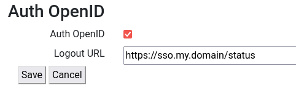

Auth OpenID
===========

OpenID authentication is used with Apache OpenID modules.

Apache Module
-------------

Install modules
~~~~~~~~~~~~~~~

::

 sudo apt install libapache2-mod-auth-openidc
 sudo a2enmod auth_openidc

Configure module
~~~~~~~~~~~~~~~~

/etc/apache2/mods-available/auth_openidc.conf

At least you will need these provided by your organization openid server:

* Secret passphrase
* ProviderMetadataURL
* Client ID

::

  OIDCRedirectURI https://rvd_server.mydomain/login_openid/redirect_uri
  OIDCCryptoPassphrase SECRET
  OIDCProviderMetadataURL https://your.openid.server/.well-known/openid-configuration
  OIDCScope "openid email profile"
  OIDCResponseType "code"
  OIDCResponseMode query
  OIDCClientID YOUR_CLIENT_ID
  OIDCClientSecret SECRET
  OIDCPKCEMethod S256
  OIDCUserInfoSignedResponseAlg RS256
  OIDCCacheShmEntrySizeMax 32000
  <Location /login_openid>
     AuthType openid-connect
     Require valid-user
  </Location>

Make the configuration for openid enabled

::

 sudo a2enmod auth_openidc

Restart Apache
~~~~~~~~~~~~~~

::

  sudo systemctl restart apache2

Other Options
~~~~~~~~~~~~~

Check official Apache OpenID documentation

https://github.com/OpenIDC/mod_auth_openidc/wiki

Login page
----------

Your Server URL
~~~~~~~~~~~~~~~

If you want your users to use OpenID by default configure the referer
login page for your Ravada server so they use this URL to authenticate

::

  https://your.server.name/login_openid

Enable OpenID
~~~~~~~~~~~~~

Ravada needs to know OpenID login is enabled and the logout page.
Go to *Admin tools* and choose *Settings*. There enable *OpenID*
and define a *logout URL*.

Configure Custom Login page
~~~~~~~~~~~~~~~~~~~~~~~~~~~

If you are using a *custom* login page make sure you have a section
pointing to the openid login.

First of all enable the *ravada app* in the login template.
Make sure you have *ng-app* , *ng-controller* and *ng-init* configured:

::

    <!DOCTYPE html>
    <html ng-app="ravada.app">
    %= include 'bootstrap/header'
    <body role="document">
        %= include 'bootstrap/navigation'
         <header id="page-top" class="intro">
            
'"
            >

Then add a link to the *OpenID login* like this:

::

  % if ($openid_available) {
      

          <a type="button" class="btn btn-success" href="/login_openid">
            <b><%=l 'Login Single Sign On' %></b>
          </a>
          

          <a data-toggle="collapse"
              ng-click="hide_local_login=!hide_local_login"
              >
              <%= "Other Authentication methods" %>
          </a>
          <small>
              <a
              ng-click="hide_local_login=!hide_local_login"
                  type="button" class="badge btn btn-secondary btn-outline-dark btn-sm">
                  <i ng-show="hide_local_login" class="fa fa-caret-right" aria-hidden="true"></i>
                  <i ng-hide="hide_local_login" class="fa fa-caret-up" aria-hidden="true"></i>
              </a>
          </small>
      

  % }

You should keep a section for plain login available just in case:

::

 
 && hide_local_login"
         class="border mb-4">
     <form method="post" action="/" class="form-singin">
         <input class="form-control mb-4" id="user" name="login" value ="<%= $login %>"
            type="text" placeholder="<%=l 'User' %>" required autofocus>
         <input class="form-control mb-4" id="pssw" type="password" name="password"
            value="" placeholder="<%=l 'Password' %>" required>

         <input type="hidden" name="url" value="<%= $url %>">
         <input id="submit"
            class="btn btn-success btn-lg btn-block" type="submit" name="submit"
            value="<%=l 'Login' %>"/>
      </form>
 

