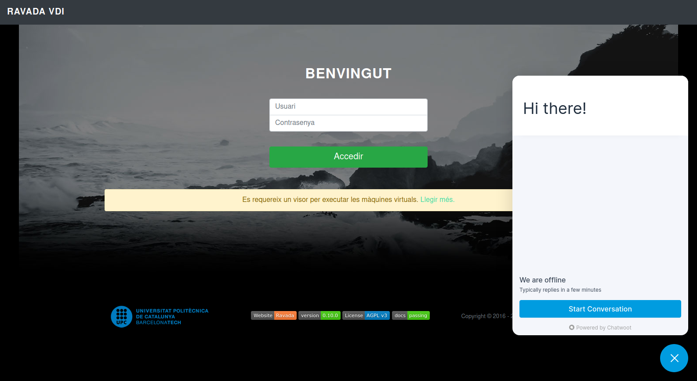
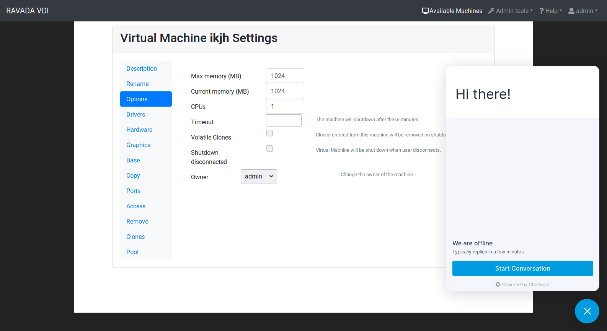

Live web Chatwoot
=================

If you want to offer a communication channel for users. We propose this simple and powerful solution.

`Chatwoot <https://chatwoot.com>`_ is live chat software. It's open source and has a great community. You can access the code `here <https://github.com/chatwoot/>`_.

You need a Chatwoot server, you have differents options. If you are interested in self-hosted follow this `guide <https://www.chatwoot.com/docs/deployment/architecture>`_.

Here you will not find a `chatwoot manual <https://www.chatwoot.com/docs/channels/website>`_, only a few steps to embed your widget code.

Once you have the widget you have to paste it in a *js* file, and add a config to Ravada.

Define widget in rvd_front.conf
-------------------------------
In ``/etc/rvd_front.conf`` configure the path to widget code. For example, ```chatwoot_widget.js```

.. code-block:: perl

    ,widget => '/js/custom/chatwoot_widget.js'

Copy your code in the file: ``/usr/share/ravada/public/js/custom/chatwoot_widget.js``.
Do not copy the *\<script\>* tags, only the javascript code.

.. code-block:: javascript
  :linenos:

	(function(d,t) {
	  var BASE_URL = "https://chatwoot.server.example.org";
	        var g=d.createElement(t),s=d.getElementsByTagName(t)[0];
	        g.src= BASE_URL + "/packs/js/sdk.js";
	        s.parentNode.insertBefore(g,s);
	        g.onload=function(){
	          window.chatwootSettings = {
	            locale: 'ca',
	            type: 'expanded_bubble',
	             launcherTitle: 'Some message',
	             showPopoutButton: true
	           }
	           window.chatwootSDK.run({
	             websiteToken: 'xxxxxxxxx4Yh7RkXPtt1',
	             baseUrl: BASE_URL
	           })
	         }
	 })(document,"script");






Security Policy
~~~~~~~~~~~~~~~

You need to allow third party content inside HTML, edit the /etc/rvd_front.conf
config file and add this line.

::

      ,security_policy => 'foo.bar.com'

This will allow the server *foo.bar.com* to all the content, see this
`guide <http://ravada.readthedocs.io/en/latest/docs/frontend_security_policy.html>`_
if you want to add different security policies.

Apply
~~~~~

Restart rvd_front service to apply changes:

.. prompt:: bash #

    systemctl restart rvd_front
