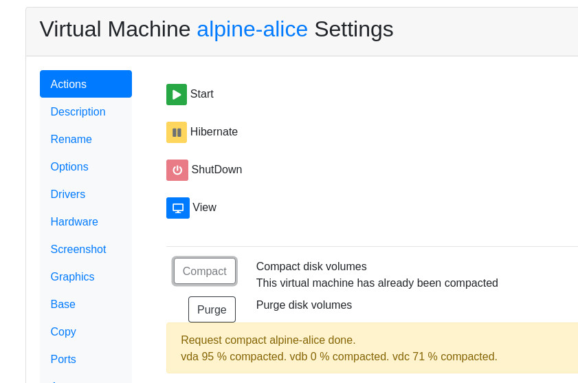

Compact Virtual Machines
========================

Virtual machines volume drives may eventually grow. Removed files still
use space. Most of the times you can retrieve back this space.

How to compact
--------------

Select the virtual machine you want to compact and go to the *Actions* tab.
There is a button to **Compact** the virtual machine.

The virtual machine must be down to compact. Active and hibernated machines
volumes will be corrupted if modified by and external processs.

Bases
-----

It is advisable to compact a virtual machine just before it is prepared
as a base.  Base volumes can be compacted but then cloned volumes would
be inconsistent so we disabled this button for bases.

Backup
------

Before compacting Ravada creates a backup of all the volumes. This backup
can be purged once you have checked the virtual machine boots properly.

If you want to recover a backup it must be done from the command line.
Shut down the virtual machine.
Check the images directory for files with the backup extension. Copy them
over the volumes.

::

root@hamilton:/var/lib/libvirt/images# ls alpine-alice-*backup
alpine-alice-vda.alpinevda.qcow2.1611569608.backup
alpine-alice-vdb.alpinevdb.SWAP.qcow2.1611569611.backup
alpine-alice-vdc.alpinevdc.DATA.qcow2.1611569613.backup
root@hamilton:/var/lib/libvirt/images# cp alpine-alice-vda.alpinevda.qcow2.1611569608.backup alpine-alice-vda.alpinevda.qcow2

Why compact
-----------

The compact procedure should not be necessary if cloned volumes didn't grow.
It is Ravada Administrators duty to properly create bases. Before allowing your
users to clone, make sure the temporary, logs, pagefile and swap files are
stored in TMP volumes.

See also
--------

* `Volume Differences <http://ravada.readthedocs.io/en/latest/docs/volume_differences.html>`_

