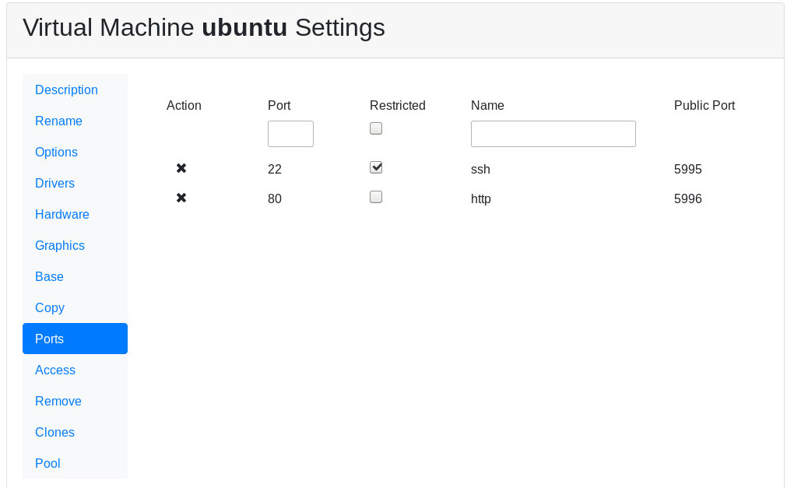
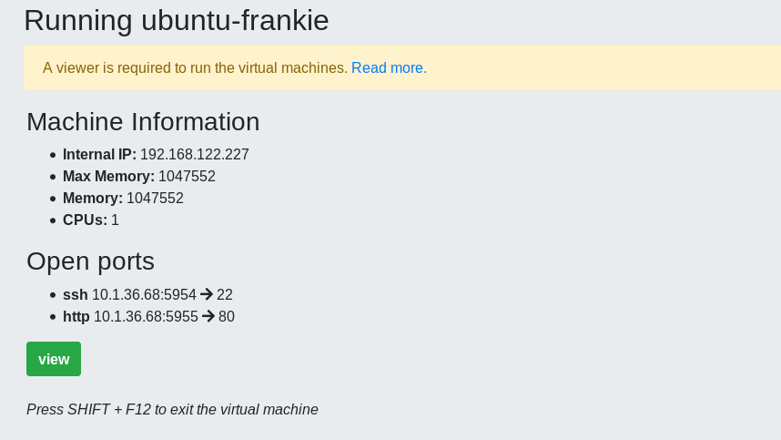

Exposing Ports from a Virtual Machine
=====================================

Since release 0.5 ports from the internal virtual machine can be
exposed to outside.

Requirements
------------

Ports exposing works with Linux Kernel *iptables* so it requires the
host to have it installed in properly configured.

The virtual machine must have a way to tell the host what is the
internal IP to the host, so the `qemu guest agent <qemu_ga.html>`_ must be installed.

Configure Expose
----------------

From the virtual machine settings there is a new menu item **Ports**.
There you can add new ports to be exposed.

There you must add the number of the internal port to be exposed and
an optional name. If you set this port to *restricted* it will only
be allowed to the remote client IP.

Fields
~~~~~~

- *Port*: internal port in the virtual machine
- *Name*: optional short description of the service to expose
- *Restricted*: restrict the port to the remote client if set

Run
---

When the virtual machine gets started Ravada searches for a free
port in the host to expose the port through.

In this example the user can connect to the IP 10.1.36.68 port 5954
to access the SSH server inside the virtual machine.

Ports redirection requires the internal IP of the virtual machine
to be active. So it retries for a while trying to redirect until
an IP is detected or it fails.

.. note:: If your exposing ports don't work. Check if the port is up and if you have the `Qemu Guest Agent <https://ravada.readthedocs.io/en/latest/docs/qemu_ga.html>`__ installed on the guest machine.

Settings
--------

Internal ports are shown in the host from a starting port number. It can be
changed from the global settings page in the *Port Expose* section.

TroubleShooting
---------------

*The port appears down when I start the virtual Machine*

Solution1: This port has a service in the virtual machine that is not up. Be sure the
service has started, and that it is listening in the correct port. Check also if this
virtual machine has an internal firewall that may block connections.

Solution2: The host must allow connections to the virtual machine. Verify the iptables in the server. You should have *ACCEPT* in the *OUTPUT* table. If you have strict restrictions, make sure you allow this:

::

  -A OUTPUT -s 192.168.122.1/32 -d 192.168.122.0/24 -j ACCEPT
