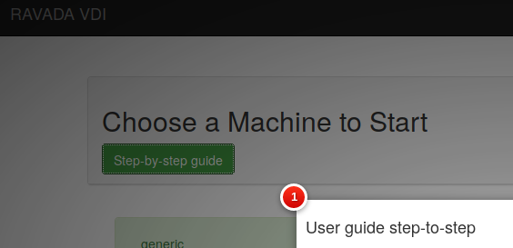
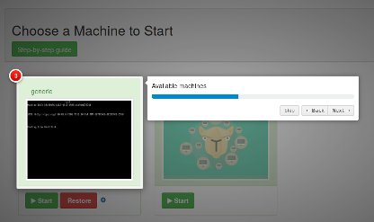

Guide button step-by-step 
=========================

The guide button offers step-by-step help. You can see a taste in the following screenshots:

Guide button is disabled for default. In order to support you have to enable guide in ``/etc/rvd_front.conf``

Enable guide
------------

In ``/etc/rvd_front.conf``:

::

    guide => 1

Restart rvd_front service: 

::
    
    systemctl restart rvd_front.service
    
Custom guide
------------
Add path in ``/etc/rvd_front.conf``:

::

	guide_custom => '/js/custom/custom_intro.js'
