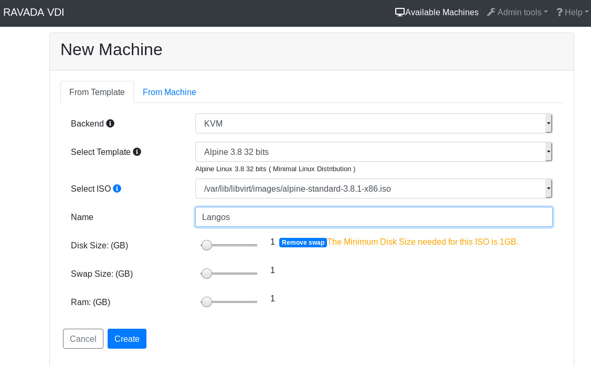
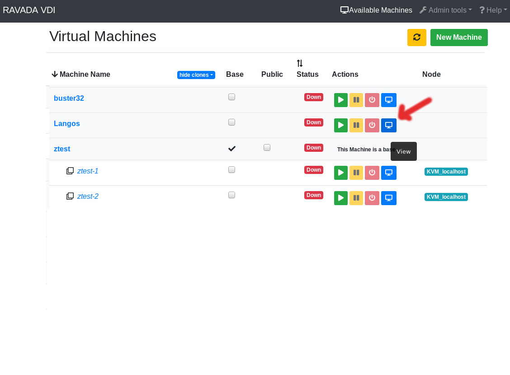

Install Alpine Linux
====================

Alpine is a really small linux distribution. It can be installed in a
really tight disk drive with barely no RAM. It is good for testing purposes
but it can also be used in production servers.

These are guidelines to install Alpine Linux inside a  Ravada KVM Guest.


Base Guest
----------

The guest should have more than 256 MB of RAM. If you are planning to run
many services you should create the virtual machine with more memory.
You can increase it later if you want to keep it slim.

At least 1GB disk drive is required. A swap partition should also be
added when creating the virtual machine.



   Create Alpine Virtual Machine


When the machine is created start it from Admin Tools menu, click on
Virtual Machines to see a list. At the right there is a bunch of buttons.
Click on *view* to start and access the virtual machine console.



   Start and View Virtual Machine

Login
-----

Once it boots login as *root* with no password.

Setup
-----

Alpine Linux has a setup script that eases the installation process. These
are the default settings we use in a Ravada-KVM Virtual Machine.

Start the setup typing:

.. prompt:: bash #

    setup-alpine

Keyboard
~~~~~~~~
First choose a keyboard layout and variant.

Hostname
~~~~~~~~

Type a *hostname* for the virtual machine. If you call it with the same
name when you created the machine before it would be easier for you:

Networking
~~~~~~~~~~

The setup will detect a network interface, probably *eth0*. Accept this value.
Also you should probably accept using *dhcp* and answer *no* to *manual network configuration*,
unless you know what you are doing.

Password
~~~~~~~~

Type a new password for the *root* user.

Timezone
~~~~~~~~

Select a timezone, the default UTC won't do any harm when you are testing, but if you
know the actual timezone, type it.

Proxy
~~~~~

If you are downloading packages through a proxy tell it now, you probably should keep
it to *none*.

Mirror
~~~~~~

Choose a mirror for Alpine to download packages from. Type *f* will check your connection
and choose the best one, it may take a while.

SSH Server
~~~~~~~~~~

Answer *openssh*  when asked about an SSH server.

Partitioning
~~~~~~~~~~~~

The setup script will ask the disk
::

    Available disks are:
    - vda
    - vdb
    Which disk(s) would you like to use? [none] vda
    How would you like to use them ? [?] sys
    WARNING: Erase the above disk(s) and continue [y/N]: y

Now the setup process will install minimal applications to start the server.

Installing more software
~~~~~~~~~~~~~~~~~~~~~~~~

You should at least install these applications and start udev:


.. prompt:: bash #

    apk add qemu-guest-agent acpi udev

    rc-update add udev
    rc-update add udev-trigger
    rc-update add udev-settle
    rc-update add udev-postmount
    rc-update add qemu-guest-agent


Shutdown and restart
--------------------

Type these commands from the console to restart and shutdown the server:

.. prompt:: bash #

    reboot


.. prompt:: bash #

    poweroff

Advanced Settings
-----------------

Add a swap partition
~~~~~~~~~~~~~~~~~~~~

If you added a swap volume in the Ravada installation form you must define it
later after the Alpine setup script.

Define de partition
```````````````````

The swap device will be probably in /dev/vdb , check first with df it is
not mounted already. If it is not shown it is ok.

Using *fdisk* you should find an empty disk and you must create the
partitions like this:
::

    localhost:~# fdisk /dev/vdb
    Command (m for help): n
    Command action
       e   extended
       p   primary partition (1-4)
    p
    Partition number (1-4): 1
    First cylinder (1-2080, default 1):
    Using default value 1
    Last cylinder or +size or +sizeM or +sizeK (1-2080, default 2080):
    Using default value 2080
    Command (m for help): w
    The partition table has been altered.
    Calling ioctl() to re-read partition table

Create the swap
```````````````

.. prompt:: bash #

    mkswap /dev/vdb1


Test it
```````
Type this to start using the swap space:

.. prompt:: bash #

   swapon -a

This command will check the memory utilization, at the bottom there should be
now a swap entry:

.. prompt:: bash #

   free

.. code::

                 total       used       free     shared    buffers     cached
    Mem:       1031924      48896     983028        100       2884      10964
    -/+ buffers/cache:      35048     996876
    Swap:      1262140          0    1262140


Add it to the system
````````````````````

.. prompt:: bash #

    echo "/dev/vdb1       swap    swap    defaults 0 0" >> /etc/fstab


Now the swap space is configured, after rebooting the system it should show typing
the *free* command.

