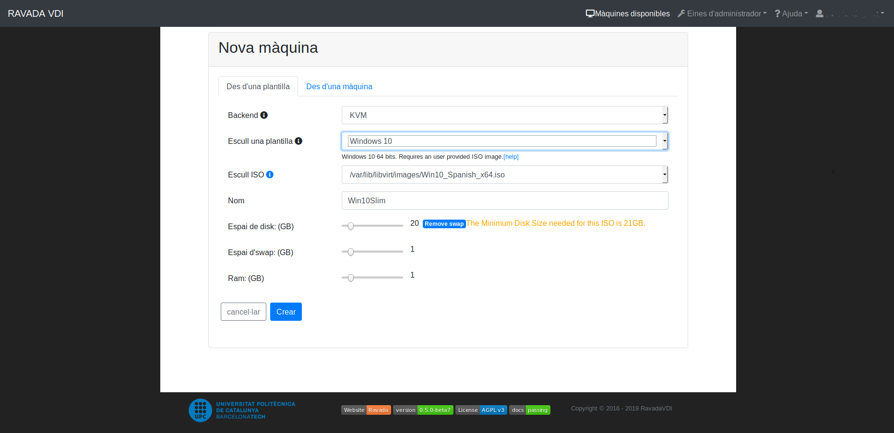
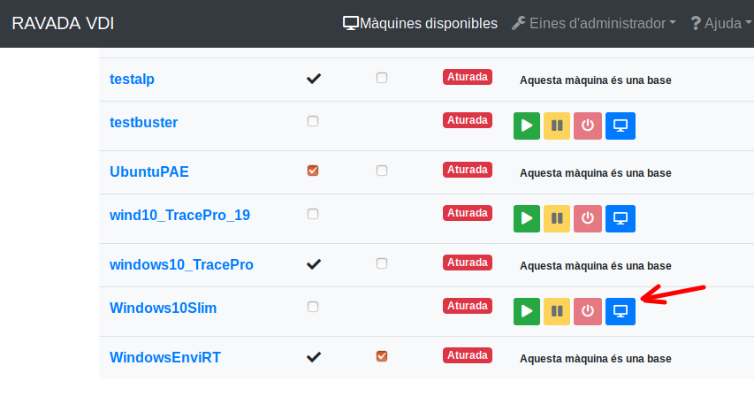

Install Windows 10
==================

These are guidelines to install Windows 10 inside a  Ravada KVM Guest.

Requirements
------------

Installation sources
~~~~~~~~~~~~~~~~~~~~

The Windows 10 ISO image file is required:

Download it and copy them in the Ravada host server
at the directory */var/lib/libvirt/images* .

Virtual Machine features
~~~~~~~~~~~~~~~~~~~~~~~~~

The guest should have more than 3 GB of RAM
You can increase it later if you want to keep it slim.

At least 30GB disk drive is required. A swap partition should also be
added when creating the virtual machine.

Create the Virtual Machine
--------------------------

From the web management tools, go to "New Machine" and create
select the Windows 10 Template and the ISO image you just downloaded.

It may take a few minutes if it is the first Windows virtual machine
that is installed in this system. Ravada will download the additional
drivers ISO volume.

When the machine is created start it from *Admin Tools menu*, click on
*Virtual Machines* to see a list. At the right there is a bunch of buttons.
Click on *view* to start and access the virtual machine console.

   Start and View Virtual Machine

Setup
-----

.. include:: _windows_drivers.rst

Follow the usual procedure to install Windows10.         

.. include:: _windows_post.rst

Use a swap partition for pagefiles
----------------------------------

By default the Windows pagefiles will go to the C: disk drive. That will make the clones partitions
grow up too much and fill your host disk drive.
It should go to the *SWAP* volume, problaby in your D: or E: drive.

In this link you can see how to move pagefiles to another disk:

https://winaero.com/blog/how-to-move-page-file-in-windows-10-to-another-disk/

