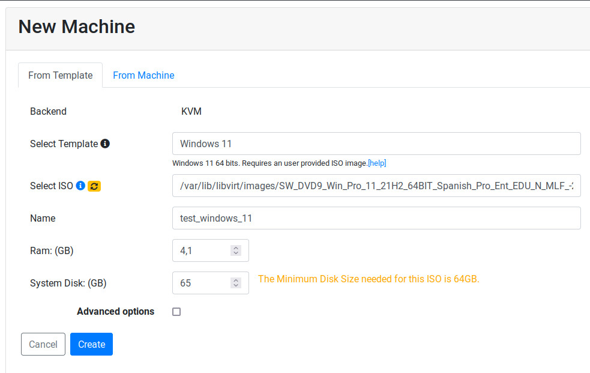
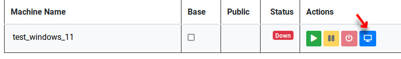
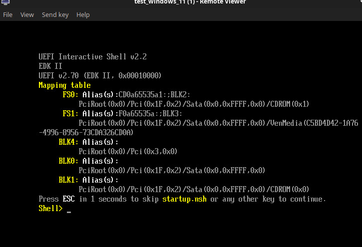

Install Windows 11
==================

These are guidelines to install Windows 11 inside a  Ravada KVM Guest.

Requirements
------------

Windows 11 requires TPM ( Trusted Platform Module ).
Follow `this guide <http://ravada.readthedocs.io/en/latest/docs/install_tpm.html>`_

Installation sources
~~~~~~~~~~~~~~~~~~~~

The Windows 11 ISO image file is required:

Download it and copy them in the Ravada host server
at the directory */var/lib/libvirt/images* .

Virtual Machine features
~~~~~~~~~~~~~~~~~~~~~~~~~

The guest should have more than 4 GB of RAM
You can increase it later if you want to keep it slim.

At least 60GB disk drive are required. A swap partition should also be
added when creating the virtual machine.

Create the Virtual Machine
--------------------------

From the web management tools, go to "New Machine" and create
select the Windows 11 Template and the ISO image you just downloaded.

    Set more than 4 GB of RAM and at least 65 GB for the disk drive.

It may take a few minutes if it is the first Windows virtual machine
that is installed in this system. Ravada will download the additional
drivers ISO volume.

Install The Operative System
----------------------------

From the Virtual Machines admin tools , click on the blue screen
from the one you just created.

The Virtual machine is starting, you will see a link for the spice
viewer. Click on it to see the virtual machine screen. The password
for the viewer will be copied in the clipboard. Just paste to in
the authentication form to access to the viewer.

Boot from CD
~~~~~~~~~~~~

You may see this screen and a *Shell>* prompt.

If you see this screen is because you missed the CD search screen.
Click on *Send Key* at the top of the viewer window, and choose
*Ctrl Alt Del*. Click back on the viewer and press a key when you
see this message:

*Press any key to boot from CD or DVD*

Install Windows 11
~~~~~~~~~~~~~~~~~~

Follow the usual procedure to install Windows 11. Select your keyboard,
language and other settings.

Load Drivers
~~~~~~~~~~~~

The installer may not see the virtual machine disk drive.
Choosing "Load Drivers" in this screen and select the one for
the operative system you are installing:

*Red Hat VirtIO SCSI controller (E:\amd64\w11\viostor.inf)*

.. figure:: images/load_windows_drivers.jpg
    :alt: VirtIO Windows Drivers

Choose Destination Drive
~~~~~~~~~~~~~~~~~~~~~~~~

Some disk drives volumes will appear. Choose the bigger one
to install Windows 11 there.

Setup
-----

Follow the usual procedure to install Windows11.

When the installations it's finished, you need to install:

* qemu-guest agent, see the instructions here: https://pve.proxmox.com/wiki/Qemu-guest-agent#Windows
* Windows guest tools - `spice-guest-tools <https://www.spice-space.org/download/windows/spice-guest-tools/spice-guest-tools-latest.exe>`_ .
* make sure that acpi service it's activated.

If you experience slow response from the mouse or other glitches you may try installing
`VirtIO Drivers <https://pve.proxmox.com/wiki/Windows_VirtIO_Drivers>`_ .

The drivers CDROM should have been automatically located in the
secondary cd drive in your system.

Use a swap partition for pagefiles
----------------------------------

By default the Windows pagefiles will go to the C: disk drive. That will make the clones partitions
grow up too much and fill your host disk drive.
It should go to the *SWAP* volume, problaby in your D: or E: drive.

In this link you can see how to move pagefiles to another disk:

https://winaero.com/blog/how-to-move-page-file-in-windows-10-to-another-disk/

