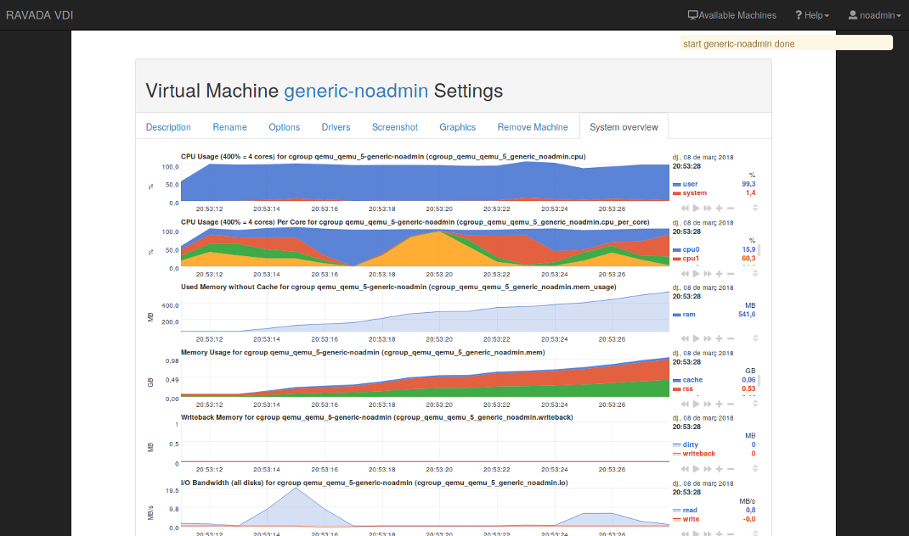
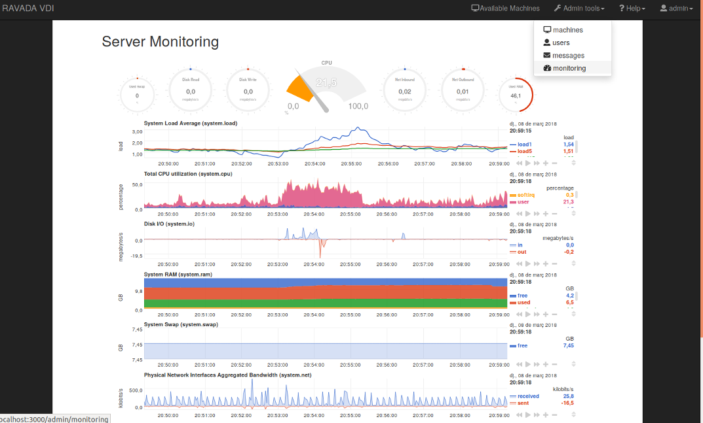

Server Monitoring
=================

From VM settings tab you can see the VM system overview:

And for admin role you can see the server:

Server monitoring is disabled for default. In order to support Ravada server monitoring, you have to do a few steps:

- install `netdata <http://my-netdata.io/>`_ on a ravada server
- and enable monitoring in ``/etc/rvd_front.conf``

Install my-netdata.io
---------------------

Follow this steps from `my-netdata.io <https://github.com/firehol/netdata/wiki/Installation>`_

or execute this on a terminal:

.. prompt:: bash #

    bash <(curl -Ss https://my-netdata.io/kickstart-static64.sh)

Linux 64bit, pre-built static binary installation for any Linux distro, any kernel version - for Intel/AMD 64bit hosts.

Apache config for netdata with SSL
----------------------------------

Enable SSL and proxy in apache:

.. prompt:: bash #

    a2enmod proxy_http proxy ssl
    a2ensite default-ssl

In ``/opt/netdata/etc/netdata/netdata.conf`` add:

::

    [web]
    default port = 19998

In ``/etc/apache2/ports.conf`` add:

::

    <IfModule ssl_module>
        Listen 443
        Listen 19999
    </IfModule>

and adding a new virtualhost for port 19999 in ``/etc/apache2/sites-available/default-ssl.conf``

::

    <VirtualHost *:19999>
                ProxyRequests Off
                ProxyPreserveHost On
                ProxyPass / http://localhost:19998/ keepalive=On
                ProxyPassReverse / http://localhost:19998/

                ErrorLog ${APACHE_LOG_DIR}/error.log
                CustomLog ${APACHE_LOG_DIR}/access.log combined

                SSLEngine on
                SSLCertificateFile      /etc/ssl/certs/server.crt
                SSLCertificateKeyFile /etc/ssl/private/server.key
                SSLCertificateChainFile /etc/ssl/certs/ca.crt
   </VirtualHost>

.. warning ::  Be careful with self-signed certificates. The browser needs to accept the certificate. We recommend the use of `Let's Encrypt <https://letsencrypt.org/>`_ or your trusted SSL provider.

Then restart netdata and apache:

.. prompt:: bash #

    systemctl restart apache2
    systemctl restart netdata

Thanks to `@jlopezramos <https://github.com/jlopezramos>`_ for this contribution.

Enable monitoring
-----------------

Monitoring is disabled by default. Add in ``/etc/rvd_front.conf`` file:

::

    monitoring => 1

Restart rvd_front service:

.. prompt:: bash #

    systemctl restart rvd_front.service

Tunning netdata
---------------

Disable mail alarms
~~~~~~~~~~~~~~~~~~~

Edit the file ``/opt/netdata/etc/netdata/health_alarm_notify.conf`` or ``/etc/netdata/health_alarm_notify.conf`` and set

::

 SEND_MAIL="NO"

Monitoring Architecture
-----------------------

All servers have a local `My-netdata <http://my-netdata.io/>`_ installation, this lets us know what happens now. Metrics in real time, small story.
The file of metrics is stored in the `Graphite <https://graphiteapp.org/>`_ server, this allows us to obtain historical and archived data.
And `Grafana <https://grafana.com/>`_ lets us know what happened in the past. Low detail metric, long history.
Follow this `link <https://github.com/firehol/netdata/wiki/netdata-backends>`_ to known more about it.

Graphite backend
----------------

Edit the file ``/opt/netdata/etc/netdata/netdata.conf``:

::

 [backend]
     host tags =
     enabled = yes
     data source = average
     type = graphite
     destination = <GraphiteServer>
     prefix = netdata
     hostname = <hostname>
     update every = 10
     buffer on failures = 10
     timeout ms = 20000
     send names instead of ids = yes
     send charts matching = *
     send hosts matching = localhost *

Graphana
--------

This `dashboard <https://grafana.com/dashboards/3938>`_ makes our lives easier.
