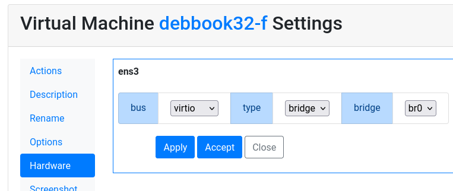

Network Bridge
==============

Virtual machines have an internal IP address in a private network
by default. They access outside using NAT from the host.

A real IP address can be configured in the virtual machines. It requires
a bridge set up in the Ravada server.

KVM provides several ways to configure guest networking,
`read this <https://www.linux-kvm.org/page/Networking>`__
if you want more information.
In this document we provide only a guide to configure network
bridging and setting this network in the guest virtual machines
using netplan.

Host Configuration
------------------

This is a guide to configure bridge when you host server has
the network configured with Netplan. If you have a recent server
you probably have it this way. For other ways to configure bridging
read the
`KVM Networking guide <https://www.linux-kvm.org/page/Networking>`__.

Network interface
~~~~~~~~~~~~~~~~~

.. warning::
      The following step will change the host network settings. This may turn the network unusable and the remote access may be disrupted. Make sure you have ways to access the server console just in case you can not access from outside.

First of all you have to identify the network interface.
Type `ip a` and find the name of the device after a number, a
couple of lines later you will be able to see the IP of your host.

::

  2: enp0s31f6: <BROADCAST,MULTICAST,UP,LOWER_UP> mtu 1500 qdisc fq_codel state UP group default qlen 1000
    link/ether 54:05:db:ac:b1:cb brd ff:ff:ff:ff:ff:ff
    inet 192.168.1.61/24 brd 192.168.1.255 scope global dynamic noprefixroute enp0s31f6

In this example we can see the name of the network device is
enp0s31f6.

Configure network bridge
~~~~~~~~~~~~~~~~~~~~~~~~

Edit the netplan configuration. There you will find the configuration
of the network interface we spotted in the previous step.
Create a new *bridges* section and add there a new bridge linked
to that interface.

::

  network:
    version: 2
    renderer: networkd
    ethernets:
      enp0s31f6:
        dhcp4: no
    bridges:
      br0:
        interfaces: [enp0s31f6]
        dhcp4: no
        addresses: [192.168.1.106/24]
        gateway4: 192.168.1.1
        nameservers:
            addresses: [192.168.1.4, 192.168.1.1 , 8.8.8.8]

Apply this configuration typing

.. prompt:: bash $

  sudo netplan try

If everything went fine now when you type `ip a` you will see
the former interface without any IP assigned, and the new
bridge *br0* configured properly. Reboot the server to make
sure everything starts correctly.

Assign the bridge to the virtual machine
~~~~~~~~~~~~~~~~~~~~~~~~~~~~~~~~~~~~~~~~

Edit the virtual machine hardware network. Set the type to *bridge* and
choose the bridge name.

