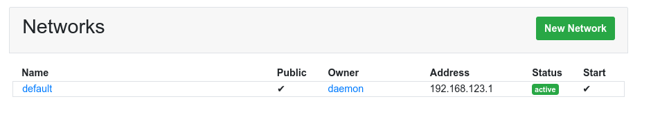
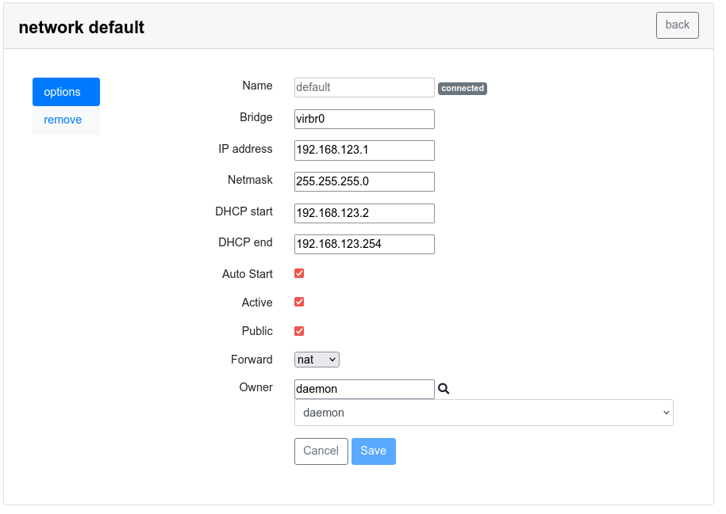

Virtual Networks
================

Administrators can create virtual networks, assign them to virtual machines
and grant permissions to other users to create their own.

With KVM, Virtual Machines are created inside a Virtual Network
with an Internal IP address. When connecting to outside all traffic
appears to come from the host. Networking is managed automatically
using Network Address Translation (NAT) .

Default Network
===============

One Virtual network is configured by default in Ravada for KVM and LibVirt.
Click on Admin Tools - Networks to list the configured virtual networks.

Click on the network name to change the settings. You
can modify the network configuration. In this example you can see this
network is loaded when the host starts, it is currently active and public.
This means every user can attach virtual machines to this network.

There is a range of internal IP addresses, when a new virtual machine
is created it will be assigned one of these IPs automatically.

Create Network
==============

Grant create network
--------------------

Admin users are allowed to manage virtual networks, but you
can grant other users permission too.

Go to "Admin Tools - Users", search for the user name and click
on "Grants". Enable *create networks* to give permission to this user.

Create a new Virtual Network
----------------------------

From the virtual networks listing there is a button that takes to
the New Network form. Ravada will provide default values for the
virtual network. You can change the name and other settings as
long as they do not conflict with existing networks.

Assign Network to Virtual Machine
=================================

Admin users can change the network where a virtual machine is
connected to, or add new interfaces and connect to several
different virtual networks.

Click on the virtual machine name in the "Admin Tools - Machines"
or access from the main screen clicking in the settings wheel
next to the virtual machine buttons.

Select the Hardware tab, next to the Network interface click on
the *edit* button to change the virtual machine network settings.
There you can change the virtual network where it is connected.
