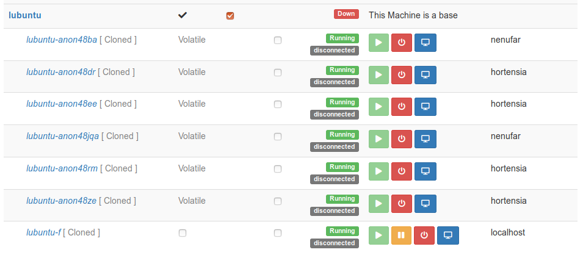
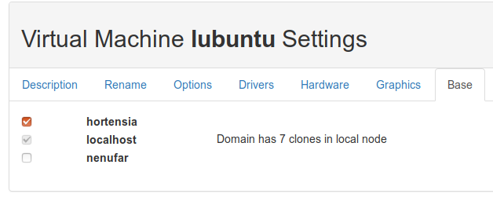

==============
Ravada Cluster
==============
----------------------------------------
Adding support for multiple Ravada nodes
----------------------------------------

Description
===========

From release 0.4 we have clustering support for Ravada. This allows the administrator
to add more physical hosts so virtual machines are balanced and distributed among all
them.

This feature is currently in alpha stage. It works but the management forms are ugly
and we need to test it more.

Nodes
=====

A node is a Ravada backend server that runs the virtual machines. With the current
implementation it is required a main master node and secondary nodes can be added
later. The master node, also known as local node should be a rock solid server.
It will also run some of the virtual machines as they get balanced among all the nodes.
Having fault tolerance master node is beyond the scope of this document, but we expect
to add a new document for examples of how to achieve it in the future. Contributions
welcome.

Secondary nodes are disposible physical hosts. It is our goal to allow theses nodes
be up and down at the administrator will and that they could be easily added
to a cluster.
Ravada should be able to cope with sudden death of those nodes, though it is better if
they are disabled and shut down nicely from the Ravada node administation frontend.

Storage
=======

Shared storage is not necessary. The base volumes will be synced across the nodes
by Ravada itself.
When bases are created, the administrator can configure on
which nodes will be available for the virtual machines.

All the master and nodes must have the same storage pools configuration.

New node
========

Requirements
------------

To add a new node to a Ravada cluster you have to install a minimal Linux operating
system with these packages. Some distributions have different package names.

- openssh-server
- libvirt-bin or libvirt-daemon
- libvirt-daemon-system
- libvirt-clients
- qemu-kvm
- rsync

It is possible to have nodes with heterogeneous operative systems: different Ubuntus,
Debians, even RedHats or Fedoras can be added, though it should be easier if all of
them are similar or identical if possible.

In some operative systems like Debian, you must create a link to the kvm file
to get the node correctly working. It is not necessary for Ubuntu or Fedora/RedHat.

.. prompt:: bash $

    ln -s /usr/bin/kvm /usr/bin/kvm-spice

Configuration
-------------

The master ravada node needs to access to the secondary nodes through SSH. So password-less
access must be configured between them. This is an example of configuring in Debian and
Ubuntu servers. Other flavours of linux should be quite the same.

Before you start
~~~~~~~~~~~~~~~~

Most of the usual mistakes come from not running the commands from the root user.
Follow the guide carefully and double check you are following the instructions exactly.
When you see a code like this it means it must run
from the root user in the master node:

.. code-block:: bash

    root@master:~#

This means you must run as the root user in the node.

.. code-block:: bash

    root@node:~#

To become root user you must either login as such or run sudo to become root:

.. code-block:: bash

    frankie@master:~ sudo bash

Configure Node
~~~~~~~~~~~~~~

First, temporary allow *root* access with *ssh* to the remote node.

.. code-block:: bash

    root@node:~# vi /etc/ssh/sshd_config
    PermitRootLogin yes

Then set a root password and restart ssh service. Warning: only do this if you haven't
already set a password for the root user in this host. If you are using an Ubuntu server
you probably haven't, but debian based distributions usually set the root user on install.

.. code-block:: bash

    root@node:~# passwd
    Enter new UNIX password: *******
    root@node:~# systemctl restart ssh

Configure Master
~~~~~~~~~~~~~~~~

Check you can access with *root* from master to node:

.. code-block:: bash

    root@master:~# ssh node

You may already have a public/private key created in the master node. Check if there
are id*pub files in /root/.ssh directory. Create the keys otherwise:

.. code-block:: bash

    frankie@master:~ sudo bash
    root@master:~# ls /root/.ssh/id*pub || ssh-keygen

Now you must copy the public ssh key from master to node:

.. code-block:: bash

    root@master:~# ssh-copy-id -i /root/.ssh/id_rsa.pub node

Check it works:

.. code-block:: bash

    root@master:~# ssh node

Now you can restore the *PermitRootLogin* entry to the former state in
the file */etc/ssh/sshd_config* at *node*.

.. code-block:: bash

   PermitRootLogin prohibit-password

Security
--------

It is advisable have a firewall configured in the node. Access restrictions
should be enforced carefully. Only allow ssh login from the master server
and other operational hosts from your network.

Networking and Firewall
=======================

For the master node to start the other nodes it must have some open ports.

Master
------

Master must be able to send packets on udp port 9 and tcp and udp port 7

::

   # wake on lan
   -A OUTPUT -p udp -m udp --dport 7 -j ACCEPT
   -A OUTPUT -p tcp -m tcp --dport 7 -j ACCEPT
   -A OUTPUT -p udp -m udp --dport 9 -j ACCEPT

Nodes
------

Nodes must accept packets on udp port 9 and tcp and udp port 7

::

   # wake on lan
   -A INPUT -p udp -m udp --dport 7 -j ACCEPT
   -A INPUT -p tcp -m tcp --dport 7 -j ACCEPT
   -A INPUT -p udp -m udp --dport 9 -j ACCEPT

Operation
=========

Add nodes in the new section *Admin Tools - Nodes*

Allow a base to create clones in nodes checking them in the machine management section,
at the *Base* tab.

Now try to create multiple clones from a base, they should get balanced
among all the nodes including the master one.

TroubleShooting
===============

..

    libvirt error code: 38, message: End of file while reading data: nc: unix connect failed: No such file or directory

It means you didn't install libvirt in the node. Fix it this way:

For Ubuntu 18.04:

.. code-block:: bash

    root@node:~# apt-get install libvirt-bin
    
From Ubuntu 18.10 instead of libvirt-bin you need install libvirt-daemon-system and libvirt-clients.

.. code-block:: bash

    root@node:~# apt-get install libvirt-daemon-system
    root@node:~# apt-get install libvirt-clients

Balance algorithm
=================

How does Ravada decides which node will handle the next virtual machine ?

We may choose a different algorithm in the future, or even allow a setting
to change it. Right now it goes that way:

The list of nodes gets sorted by the number of virtual machines running.
If there is a tie, the node with more free memory is chosen.

We have an extra step for speeding things up, when checking the nodes
status, if one has less than 2 virtual machines running, and it has
free available memory, it is picked.

There is a drawback we have yet to fix: if many virtual machines are
started at the same time, some may probably go to the same node. This
is because a lot of work is done in parallel.

If you think this could be improved we are open to suggestions.

TODO
====

We already know we have to improve:

- administration forms in the web front
- check if nodes storage gets filled
- documentation

This is a new feature, we are currently testing. Feedback welcome through our
Telegram public forum http://t.me/ravadavdi or
`github issues <https://github.com/UPC/ravada/issues>`_ .

