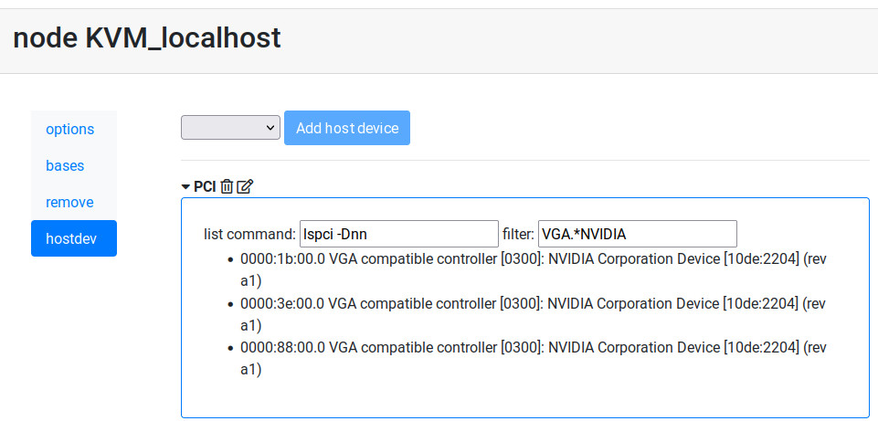
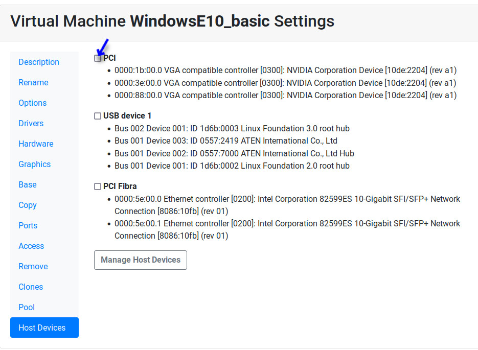
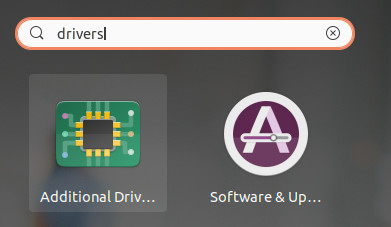

PCI GPU Device Passthrough
==========================

In this document we show how to add a NVIDIA GPU to a KVM virtual Machine
in Ravada VDI. Any PCI device could be added in a similar way.

.. note:: We will not use the GPU as a display device in this guide. We will only try to run GPU calculations with CUDA.

Status
------

Please note that this is a very active topic and the instructions outlined here
might not work in your environment

Requirements
------------

* One or more NVidia GPUs
* A properly configured kernel along with a recent version of qemu. We were successful with Ubuntu 20.04 with kernel 5.8.
* Ravada version 2.0. It is currently labelled as *alpha* but it is being used in production in our own servers.

Hardware Identification
-----------------------

.. prompt:: bash $

    sudo lspci -Dnn | grep NVIDIA
    0000:1b:00.0 VGA compatible controller [0300]: NVIDIA Corporation Device [10de:2204] (rev a1)
    0000:1b:00.1 Audio device [0403]: NVIDIA Corporation Device [10de:1aef] (rev a1)

As you can see there are two devices attached to this PCI, that is because the video
card has also an audio device. From here we gather:

* PCI data: 0000:1b:00.0 and 0000:1b:00.1
* Devices: 10de:2204 and 10de:1aef

OS Configuration
----------------

This is the configuration for the host server. We must setup the kernel so the
PCI device is not used in any way so it can be passed to the virtual machine.

Grub
~~~~

Add this to GRUB_CMDLINE_LINUX line in */etc/default/grub*. This is suited for Intel
computers. Notice we added the devices identified in the previous step to *pci-stub*.

Here we are preventing the GPU to be used by the main host so it can be passed
to the virtual machine.

::

    GRUB_CMDLINE_LINUX_DEFAULT="snd_hda_intel.blacklist=1 nouveau.blacklist=1 intel_iommu=on rd.driver.pre=vfio-pci pci-stub.ids=10de:2204,10de:1aef"

AMD require a similar setup adding

::

    GRUB_CMDLINE_LINUX_DEFAULT="snd_hda_intel.blacklist=1 nouveau.blacklist=1 amd_iommu=on iommu=pt kvm_amd.npt=1 kvm_amd.avic=1 rd.driver.pre=vfio-pci pci-stub.ids=10de:2204,10de:1aef"

Modules
~~~~~~~

Blacklist modules creating the file /etc/modprobe.d/blacklist-gpu.conf

::

  blacklist nouveau
  blacklist radeon
  blacklist amdgpu
  blacklist snd_hda_intel
  blacklist nvidiafb

GPUs with embedded USB
~~~~~~~~~~~~~~~~~~~~~~

If your *GPU* also sports an *USB device*, you need to check what driver
this device is using and blacklist it here also. Use `lspci -Dnn -k` to
check what driver it is using.

Then add it to the endh of the file /etc/modprobe.d/blacklist-gpu.conf:

::

  blacklist xhci_pci

Also prevent the nvidia drivers to load and raise vfio-pci instead in /etc/modprobe.d/nvidia.conf

::

  softdep nouveau pre: vfio-pci
  softdep nvidia pre: vfio-pci
  softdep nvidia* pre: vfio-pci

Add the modules so they are loaded on boot in /etc/modules

::

    vfio vfio_iommu_type1 vfio_pci ids=10de:2204,10de:1aef

Pass the device identifiers to vfio-pci in /etc/modprobe.d/vfio.conf. This is duplicated
from the previous step, it may be removed eventually from this doc if we find it
unnecessary. Anyway it doesn't harm.

::

  options vfio-pci ids=10de:2204,10de:1aef disable_vga=1

When loading KVM make it ignore MSRS in /etc/modprobe.d/kvm.conf
options kvm ignore_msrs=1

::

  options kvm ignore_msrs=1

Add id of the deviced used by nvidia at /etc/initramfs-tools/modules. This must be one line:

::

   vfio vfio_iommu_type1 vfio_virqfd vfio_pci ids=10de:2204,10de:1aef,10de:1ad8

Update the grub and initram configuration and reboot.

.. prompt:: bash $

  sudo update-grub
  sudo update-initramfs -u
  sudo reboot

Checks
------

Modules
~~~~~~~

No nvidia nor nouveau should be loaded:

.. prompt:: bash $

    sudo lsmod | egrep -i "(nouveau|nvidia)"

The device should use vfio driver:

.. prompt:: bash $

    lspci -k | egrep -A 5 -i nvidia

::

  1b:00.0 VGA compatible controller: NVIDIA Corporation Device 2204 (rev a1)
	Subsystem: Gigabyte Technology Co., Ltd Device 403b
	Kernel driver in use: vfio-pci
	Kernel modules: nvidiafb, nouveau
  1b:00.1 Audio device: NVIDIA Corporation Device 1aef (rev a1)
	Subsystem: Gigabyte Technology Co., Ltd Device 403b
	Kernel modules: snd_hda_intel

See that though in the NVIDIA VGA the preferred kernel modules are nvidiafb and nouveau,
it actually loads vfio-pci which is great.

IOMMU
~~~~~

Check it is enabled

.. prompt:: bash $

    dmesg | grep -i iommu | grep -i enabled

::

    [    0.873154] DMAR: IOMMU enabled

Verify the iommu groups. Both devices should be in the same group. We use *grep*
to search for the PCI device numbers we found in the very first step.

.. prompt:: bash $

  dmesg | grep iommu | grep 1b:00

::

  [    2.474726] pci 0000:1b:00.0: Adding to iommu group 38
  [    2.474807] pci 0000:1b:00.1: Adding to iommu group 38

Ravada Setup
---------------------

Now we want to use the GPU, by now we will only try to execute CUDA so it
will not be a device used for display. This can also be achieved but it will
be addressed in future releases.

After we have the host configured we must tell Ravada we want to pass
some PCI devices to the virtual machines.

Configure the Node Host Device
~~~~~~~~~~~~~~~~~~~~~~~~~~~~~~

At the node configuration we add a PCI Host Device group. This is a pool of
devices that will be added to the clones.

In this example we select PCI and then click on "Add host device".

After a few seconds we can see the PCI devices available in the host, we
filter only the Nvidia brand.

Now the Host Device will be available in the Hardware configuration in the
virtual machine.

Now, when the virtual machine is started it will pick one of the free
devices and it will appear as a PCI entry.

Virtual Machine GPU Ubuntu setup
--------------------------------

As an example we load the GPU in Ubuntu and verify it is being used.

Packages
~~~~~~~~

Configure from the graphical interface to load propietary drivers
for NVIDIA server.

    Search for the additional drivers application

    Press the Windows key and type additional , click in the application
    called *Additional Drivers*

.. figure:: images/ubuntu_additional_drivers_select.png
    :alt: select the NVIDIA drivers

    Choose the NVIDIA driver for servers

    In our scenario we only want to run CUDA on the GPU so we just select
    the server drivers.

This is the list of packages for our setup:

* nvidia-compute-utils-460-server
* nvidia-dkms-460-server
* nvidia-driver-460-server
* nvidia-kernel-common-460-server
* nvidia-kernel-source-460-server
* nvidia-settings
* nvidia-utils-460-server

Choose the Display VGA
~~~~~~~~~~~~~~~~~~~~~~

After installing the NVidia drivers the Window Manager may try to run on
top of the GPU and fail. Choose the other video card:

First let's what cards do you have:

::

    $ sudo prime-select
    Usage: /usr/bin/prime-select nvidia|intel|on-demand|query

Choose not nvidia, in our case it is intel:

.. prompt:: bash

    sudo prime-select intel

Add the nvidia module to load on startup. Check there is this line in /etc/modules

::

  nvidia_uvm

Reboot the virtual machine now. The other VGA should be used for display and the NVIDIA GPU
can be used to run other tasks.

CUDA
----

In this particular installation we wanted to try CUDA. We install the
package and check if it works:

.. prompt:: bash $

  sudo apt install nvidia-cuda-toolkit
  nvidia-smi

If it works nvidia smi will show the detected hardware:

::

    Driver Version                            : 460.73.01
    CUDA Version                              : 11.2
    Attached GPUs                             : 1
    GPU 00000000:01:01.0
    Product Name                          : GeForce RTX 3090
    Product Brand                         : GeForce

References
----------

* https://mathiashueber.com/windows-virtual-machine-gpu-passthrough-ubuntu/

