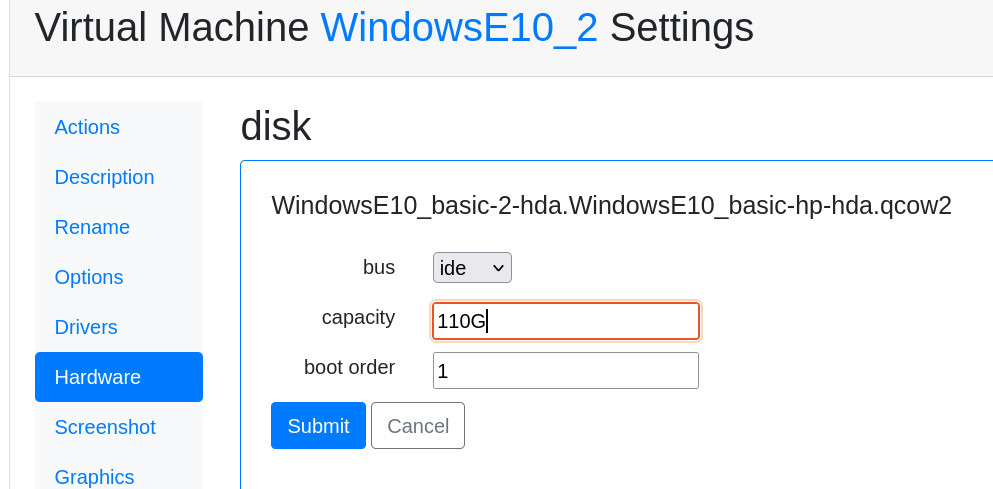

How to extend a Ravada Windows guest's disk space
=================================================

Extending a Windows disk drive in a virtual machine is a straightforward
process. Follow this guide carefully.

The process requires execute a hardware change in the Ravada frontend and
then use the command line in the host to resize the partition.

Shutdown
--------

The virtual machine must be down to resize the volumes. Press *Shutdown* button
in the *Admin Tools*.

Backup
------

Make a backup of the disk volumes. The easiest way is to
`compact <http://ravada.readthedocs.io/en/latest/docs/compact.html>`_
the virtual machine. After that you should have a copy of all the volumes
in the images directory. Usually located at /var/lib/libvirt/images.

Expand the volume
-----------------

Go to the *Hardware* tab in the virtual machine settings. Select the
disk drive you want to extend and type the desired size of the volume.

Remove and create the partition again
-------------------------------------

This part of the process must be down in the command line. Connect to the
server console and go to the images directory:

.. prompt:: bash

  sudo bash
  cd /var/lib/libvirt/images

Connect the disk volume as a device
~~~~~~~~~~~~~~~~~~~~~~~~~~~~~~~~~~~

.. prompt:: bash root@telecos:/var/lib/libvirt/images#

  modprobe nbd
  qemu-nbd -c /dev/nbd1 /var/lib/libvirt/images/WindowsE10-hda.qcow2

Now the volume appears as an nbd device in the host system. You can use fdisk and other
tools to change the partitions.

Remove and create the partition
~~~~~~~~~~~~~~~~~~~~~~~~~~~~~~~

First let's check what are the partitions with *fdisk*:

.. prompt:: bash root@telecos:/var/lib/libvirt/images#

  fdisk /dev/nbd1
  p

::

  Disk /dev/nbd1: 110 GiB, 118111600640 bytes, 230686720 sectors
  Units: sectors of 1 * 512 = 512 bytes
  Sector size (logical/physical): 512 bytes / 512 bytes
  I/O size (minimum/optimal): 512 bytes / 512 bytes
  Disklabel type: dos
  Disk identifier: 0x88e082d8
  
  Device      Boot   Start      End  Sectors  Size Id Type
  /dev/nbd1p1 *       2048  1126399  1124352  549M  7 HPFS/NTFS/exFAT
  /dev/nbd1p2      1126400 62912511 61786112 29,5G  7 HPFS/NTFS/exFAT
  

The partition we want to change is the second one (nbd1p2). From fdisk:

::

  # fdisk /dev/nbd1
  Command (m for help): d
  Partition number (1,2, default 2):
  Partition 2 has been deleted.

Now we create the partition again but using all the space we just added.
*Warning*: when asked about remove the signature, answer N.

::

  Command (m for help): n
  Partition type
     p   primary (1 primary, 0 extended, 3 free)
     e   extended (container for logical partitions)
  Select (default p): p
  Partition number (2-4, default 2):
  First sector (1126400-230686719, default 1126400):
  Last sector, +/-sectors or +/-size{K,M,G,T,P} (1126400-230686719, default 230686719):
  Created a new partition 2 of type 'Linux' and of size 109,5 GiB.
  Partition #2 contains a ntfs signature.
  Do you want to remove the signature? [Y]es/[N]o: N

As it was a NTFS partition we change it to that

::

  Command (m for help): t
  Partition number (1,2, default 2):
  Hex code (type L to list all codes): 7
  Changed type of partition 'Linux' to 'HPFS/NTFS/exFAT'.

Then save an exit fdisk:

::

  Command (m for help): w
  The partition table has been altered.
  Calling ioctl() to re-read partition table.
  Syncing disks.

Fix the new partition
---------------------

The new partition must be checked and fixed before resize.

ntfsfix
~~~~~~~

Fix it first in the host:

.. prompt:: bash #

  ntfsfix /dev/nbd1p2

chkdsk
~~~~~~~

Now we need to let the Windows virtual machine to check the drive.

First of all disconnect the device from the *nbd* to let it run in the virtual machine.
It is a good idea to remove the *nbd* module to make sure it is properly disconnected.

.. prompt:: bash #

  qemu-nbd -d /dev/nbd1
  rmmod nbd

Boot the virtual machine, enter the *cmd* as admin and check the disk. This command
will check the disk on the next reboot. Answer yes when asked and reboot the virtual
machine. It will probaly warn you that the disk will be checked unless a key is pressed.
Do not press any key, let it continue itself. In a few seconds it will be verified.

::

  C:> chkdsk c: /f

Come back again to the host and tell the filesystem to resize itself to the new full size limit:

.. prompt:: bash #

  modprobe nbd
  qemu-nbd -c /dev/nbd1 /var/lib/libvirt/images/WindowsE10-hda.qcow2
  ntfsresize /dev/nbd1p2

Disconnect again the nbd and start the virtual machine.

.. prompt:: bash #

  qemu-nbd -d /dev/nbd1
  rmmod nbd

Check the new size
------------------

Boot the virtual machine again, go to storage properties of the PC. The new size
should be available:

.. figure:: images/new_size.jpg
