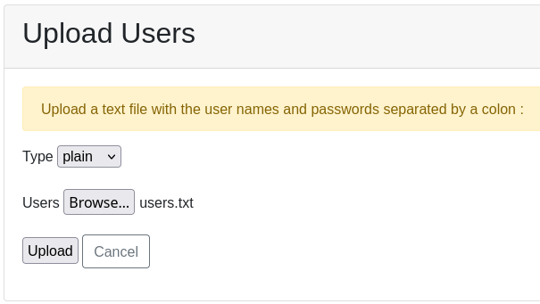
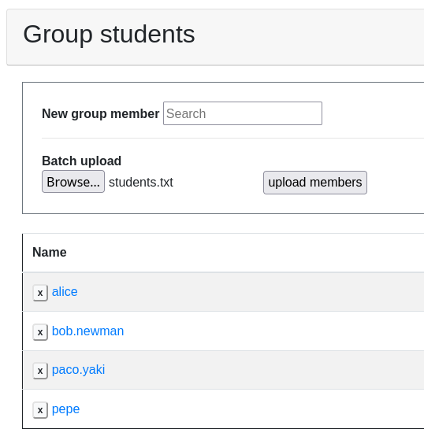

For small Ravada installations users can be added manually
from the administration web page. There are more options for
adding users and groups.

Users Batch Uploading
=====================

From the users administration page there is a button "New user".
There users can be added one by one or uploaded from a file
clicking in "Batch Upload"

Plain users and password
~~~~~~~~~~~~~~~~~~~~~~~~

We consider plain users as usernames stored in the SQL database.
Create a file with names and passwords separated by colon (:)
and upload it.

Delegated login
~~~~~~~~~~~~~~~

Access can be delegated to another third party application.
Currently these are suported:

* LDAP
* CAS
* OpenID

By default, any user that is granted access is allowed to
use Ravada. In some environments the administrator may want to
filter the users allowed. In this case, first disable
"Auto create users" at the administration settings.
From now on only previously authorized users can log in.

Then upload a file with a list of allowed usernames.

.. image:: images/upload_users_openid.png

Groups
======

It is also possible to populate a group either manually one
by one or uploading a list of members.

Uploading with web browser
~~~~~~~~~~~~~~~~~~~~~~~~~~

Just create a text file with a list of users, one at each line
and upload from the "Group Administration" page.

File Formats
============

There are two file formats for uploading users and groups. You can
either use text or json.

Text Files
~~~~~~~~~~

Text files should have the *.txt* extension. The files must contain
one entry in each line.

Example: local users with password:
---------------------------------

Choose *plain* type from the uploading page. users.txt
::

  alice:lkjdfljg
  bob:lkj¡klñkdgf
  charles:kkhofgo

Example: local group
--------------------

Create a file with the name of the group, ie: accounting.txt

::

  alice
  bob
  daniel

JSON Files
~~~~~~~~~~

Using *JSON*, administrators can upload simple or complex list of
users, groups and members.

Example: json users
-------------------

This is a list of users, they will be uploaded as
external auth, because the password is not declared.

::

  { "users": ["alice","bob","charlie"]}

Example: json groups
--------------------

This is a list of groups.

::

  { "groups": ["accounting","it","marketing"]}

Example: json groups and users
--------------------------------

Both users and groups can be uploaded in the same *JSON* file.

::

  { "users": ["alice","bob","charlie"]
  , "groups": ["accounting","it","marketing"]}

Example: json group members
---------------------------

This is an extended form of group and users creation. Inside the
groups listing you have to specify the name and a list of members.
The users
do not need to be listed separately, they will be created
from the members list.

::

  {
      "groups": [
          {"name":"accounting"
              ,"members": ["alice","bob"]
          }
          ,{"name":"it"
              ,"members": ["alice","charlie"]
          }
          ,{"name": "marketing"
              ,"members": ["daniel","ethan"]
          }
      ]
  }

Example: flushing group members
-------------------------------

When uploading group members, by default they will be added to the group.
If you need to remove old members, you can add an option to flush it.

If you run the previous example, then this one, the user "alice" will
be removed from the accounting group.

::

  {
      "options": { "flush": "1" }
      ,"groups": [
          {"name":"accounting"
              ,"members": ["bob"]
          }
          ,{"name":"it"
              ,"members": ["alice","charlie"]
          }
          ,{"name": "marketing"
              ,"members": ["daniel","ethan"]
          }
      ]
  }

Example: removing empty groups
------------------------------

You can add an option to also remove empty groups. It is important
to follow these rules:

1. Add both "flush" and "remove_empty" options with value "1".

2. Add a list of empty members

After uploading this file, the group accounting will be removed.

::

  {
      "options": { "flush": "1", "remove_empty": "1" }
      ,"groups": [
          {"name":"accounting"
              ,"members": []
          }
          ,{"name":"it"
              ,"members": ["alice","charlie"]
          }
          ,{"name": "marketing"
              ,"members": ["daniel","ethan"]
          }
      ]
  }

CLI
~~~

It is also possible to upload the group members from the command line.
In the Ravada host server use the rvd_back command.

Add members to one group
------------------------

By default, the group name will be the name of the file. So this command
will create the group "students" and will add all the names in the file
to it.

::

  sudo rvd_back --upload-group-members=students.txt

The group name can be supplied if necessary:

::

  sudo rvd_back --upload-group-members=members.txt --group=students

Add members to many groups
--------------------------

If you want to create a large amount of groups, store the files in
a directory and pass it to the CLI. All the groups will be created
using the filenames as names for each group.

::

  sudo rvd_back --upload-group-members=/var/lib/groups/

