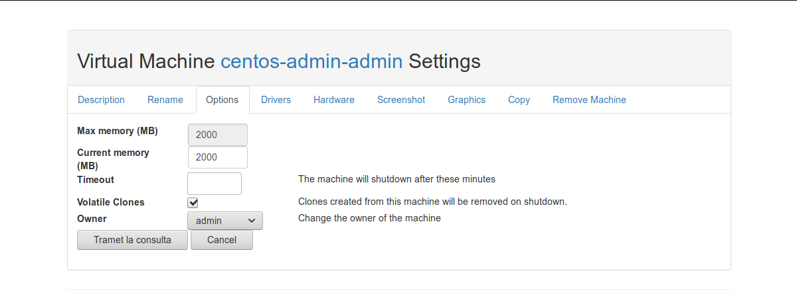

How to do a volatile Virtual Machine
====================================

This means that the virtual machine will be removed when shutdown. 

..info:: If you enable this option in a base machine, the clones that are created thereafter will be volatile. The VMs cloned so far, if they existed, are not affected.

Enable/disable this option
--------------------------

You can enable or disable this option from the VM settings in the options tab.

